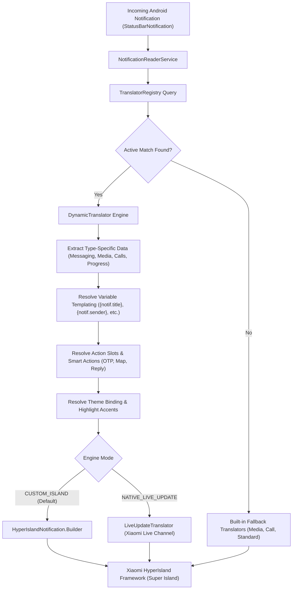

This document provides the authoritative technical reference for the **Custom Translators Framework** (`.htrans`) in Hyper Bridge 0.6.0. It is designed for developers, theme authors, and power users building custom notification pipelines, automation tools, or community packages.

---

## Architectural Overview

Hyper Bridge operates as an event-driven translation engine that intercepts incoming `StatusBarNotification` events from the Android Notification Listener Service and transforms them into native Xiaomi HyperOS Super Island specifications.



### Interception Pipeline Rules
1. **Allowlist Bypass:** If a Custom Translator explicitly targets a specific package (via `SPECIFIC_APPS` or `SYSTEM_APPS`), the application **bypasses the global app allowlist**. It is processed even if the user has not enabled the app in the global library list.
2. **Evaluation Precedence:** The in-memory `TranslatorRegistry` indexes all active rules into prioritized buckets:
   $$\text{SPECIFIC\_APPS} \succ \text{SYSTEM\_APPS} \succ \text{NOTIFICATION\_TYPE} \succ \text{GLOBAL}$$
   Within each scope tier, translators are evaluated in descending order of their `priority` integer (e.g. `200` executes before `100`).
3. **Short-Circuit Evaluation:** The first translator whose `TranslatorConditions` and `TypeSpecificConditions` evaluate to `true` claims the notification.

---

## The `.htrans` Package Anatomy

A Custom Translator can be packaged as a single `.htrans` archive or distributed as a raw `.json` file.

```text
my_translator.htrans (ZIP Archive)
├── translator.json        (Required: Schema definition)
└── icons/                 (Optional: Custom graphics)
    ├── ic_custom_action.png
    └── ic_badge.webp
```

### Packaging & Security Specifications
- **ZIP Container:** Standard Deflate-compressed ZIP container renamed to `.htrans`.
- **Zip-Slip Protection:** When extracting, the `TranslatorRepository` validates every canonical entry path against the target directory to prevent directory traversal attacks.
- **Internal Storage Location:** Extracted icon assets are stored locally under:
  ```text
  context.filesDir/translators/{translator_id}/icons/
  ```
- **Theme Bundling:** Themes (`.htheme` / `.hbr`) can bundle translators in a root `translators/` directory:
  ```text
  neon_theme.htheme (ZIP Archive)
  ├── theme.json
  └── translators/
      ├── spotify_enhanced.htrans
      └── delivery_tracker.json
  ```

---

## Complete JSON Schema Reference

### 1. Root: `CustomTranslator`

| Field | Type | Default | Description |
|---|---|---|---|
| `id` | `String` | *(Required)* | Unique identifier (e.g. `com.example.whatsapp.vip`). |
| `meta` | `TranslatorMetadata` | *(Required)* | Human-readable metadata and author information. |
| `target_scope` | `TargetScope` | `SPECIFIC_APPS` | Scope tier for evaluation order (`GLOBAL`, `SPECIFIC_APPS`, `SYSTEM_APPS`, `NOTIFICATION_TYPE`). |
| `target_packages` | `List<String>` | `[]` | Android package names when scope is `SPECIFIC_APPS` or `SYSTEM_APPS`. |
| `target_notification_types` | `List<String>` | `[]` | Notification category strings when scope is `NOTIFICATION_TYPE` (e.g. `MESSAGING`, `MEDIA`). |
| `priority` | `Int` | `100` | Evaluation priority (higher numbers execute first). |
| `is_enabled` | `Boolean` | `true` | Master active toggle for the translator. |
| `conditions` | `TranslatorConditions` | `{}` | Pattern-matching rules and criteria. |
| `theme_binding` | `ThemeBinding` | `{}` | Accent color, icon mask, and theme linkages. |
| `engine_mode` | `EngineMode` | `INHERIT` | Island rendering engine (`INHERIT`, `CUSTOM_ISLAND`, `NATIVE_LIVE_UPDATE`). |
| `behavior_override` | `BehaviorOverride` | `{}` | Timeout, floating banner, and dismissibility overrides. |
| `data_extraction` | `DataExtractionConfig` | `{}` | Regex rules for parsing progress percentages. |
| `custom_variables` | `List<CustomVariableDefinition>` | `[]` | Dynamic variable extraction pipeline (regex capture, icons, step progress). |
| `custom_actions` | `List<CustomActionDefinition>` | `[]` | Dynamic action binding pipeline (index, regex, smart actions, inline reply). |
| `presentation` | `PresentationConfig` | `{}` | Visual layout, text templates, action slots, compact pill, or `raw_param_v2` JSON. |

---

### 2. `TranslatorMetadata`

| Field | Type | Default | Description |
|---|---|---|---|
| `name` | `String` | *(Required)* | Display title of the translator. |
| `author` | `String` | `"Community"` | Author name or handle. |
| `version` | `Int` | `1` | Schema revision integer. |
| `description` | `String` | `""` | Brief description of what the translator does. |
| `icon_name` | `String` | `"AutoAwesome"` | Name of the Material icon displayed in the manager list. |
| `share_link` | `String?` | `null` | Optional URL to community repo or documentation. |

---

### 3. `TargetScope` Enum

| Value | Evaluation Order | Description |
|---|---|---|
| `SPECIFIC_APPS` | **1st (Highest)** | Evaluates exclusively against notifications from packages in `target_packages`. |
| `SYSTEM_APPS` | **2nd** | Evaluates explicitly targeted system packages (bypasses default system filter). |
| `NOTIFICATION_TYPE` | **3rd** | Evaluates against specific categories (`MESSAGING`, `MEDIA`, `CALLS`, `PROGRESS`). |
| `GLOBAL` | **4th (Lowest)** | Evaluates across all notifications on the device matching regex conditions. |

---

### 4. `TranslatorConditions`

| Field | Type | Default | Description |
|---|---|---|---|
| `title_regex` | `String?` | `null` | Regular expression matched against `Notification.EXTRA_TITLE`. |
| `text_regex` | `String?` | `null` | Regular expression matched against `Notification.EXTRA_TEXT`. |
| `subtext_regex` | `String?` | `null` | Regular expression matched against `Notification.EXTRA_SUB_TEXT`. |
| `category` | `String?` | `null` | Android notification category string (e.g. `CATEGORY_MESSAGE`, `CATEGORY_CALL`). |
| `channel_id` | `String?` | `null` | Exact NotificationChannel ID. |
| `has_extras` | `List<String>` | `[]` | Required bundle keys that must be present in `notification.extras`. |
| `has_actions` | `Boolean?` | `null` | If `true`, notification must contain at least one `Notification.Action`. |
| `has_progress` | `Boolean?` | `null` | If `true`, notification must define `EXTRA_PROGRESS` or match progress regex. |
| `type_specific_conditions` | `TypeSpecificConditions?` | `null` | Domain-specific extractors for Messaging, Media, Calls, and Navigation. |

---

### 5. `TypeSpecificConditions`

#### A. Messaging (`messaging`)
| Field | Type | Default | Description |
|---|---|---|---|
| `sender_name_regex` | `String?` | `null` | Regex matched against extracted contact name (`Person.getName()` or `EXTRA_MESSAGING_PERSON`). |
| `conversation_title_regex` | `String?` | `null` | Regex matched against group chat conversation title (`EXTRA_CONVERSATION_TITLE`). |
| `is_group_conversation` | `Boolean?` | `null` | Filter based on whether the message is from a group chat. |

#### B. Media (`media`)
| Field | Type | Default | Description |
|---|---|---|---|
| `artist_regex` | `String?` | `null` | Regex matched against artist in `MediaMetadataCompat`. |
| `album_regex` | `String?` | `null` | Regex matched against album name. |
| `is_playing` | `Boolean?` | `null` | Matches playback state (`PlaybackStateCompat.STATE_PLAYING`). |

#### C. Calls (`call`)
| Field | Type | Default | Description |
|---|---|---|---|
| `caller_name_regex` | `String?` | `null` | Regex matched against caller identification. |
| `call_type` | `CallTypeCondition?` | `null` | Call state enum: `INCOMING`, `ONGOING`, or `MISSED`. |

#### D. Navigation (`navigation`)
| Field | Type | Default | Description |
|---|---|---|---|
| `instruction_regex` | `String?` | `null` | Regex matched against turn-by-turn guidance strings. |
| `distance_regex` | `String?` | `null` | Regex matched against remaining distance / ETA indicators. |

#### E. Progress (`progress`)
| Field | Type | Default | Description |
|---|---|---|---|
| `min_progress_percent` | `Int?` | `null` | Minimum progress percentage required to match (0–100). |
| `max_progress_percent` | `Int?` | `null` | Maximum progress percentage required to match (0–100). |

---

### 6. `DataExtractionConfig`

| Field | Type | Default | Description |
|---|---|---|---|
| `extract_progress_from_text` | `Boolean` | `false` | When `true`, parses numbers from notification text if `EXTRA_PROGRESS` is missing. |
| `progress_regex` | `String?` | `null` | Capture group regex to extract numeric progress (e.g. `(\d+)%` or `(\d+)\s*/\s*100`). |
| `custom_max_progress` | `Int` | `100` | The denominator used to calculate percentage if not explicitly defined. |
| `substitute_variables` | `Map<String, String>` | `{}` | Custom static key-value replacements applied before template rendering. |

---

### 7. `ActionSlotConfig`

| Field | Type | Default | Description |
|---|---|---|---|
| `slot_position` | `Int` | `0` | Button position on the island card (`0`, `1`, `2`). |
| `is_visible` | `Boolean` | `true` | Toggle to show or hide this specific action button. |
| `source` | `ActionSource` | `NOTIFICATION_ACTION` | Action provider (`NOTIFICATION_ACTION`, `SMART_ACTION`, `INLINE_REPLY`, `CUSTOM_BROADCAST`). |
| `action_matcher` | `ActionMatcher` | `{}` | Matcher criteria when source is `NOTIFICATION_ACTION`. |
| `smart_action_type` | `SmartActionType?` | `null` | Smart Action function (`OTP_COPY`, `OPEN_URL`, `DIAL_NUMBER`, `TRACK_PACKAGE`). |
| `display_mode` | `ActionDisplayMode` | `ICON_ONLY` | Visual appearance: `ICON_ONLY`, `TEXT_ONLY`, `ICON_AND_TEXT`. |
| `custom_label` | `String?` | `null` | Custom string overriding the original button label. |

#### `ActionMatcher`
| Field | Type | Default | Description |
|---|---|---|---|
| `match_by` | `ActionMatchBy` | `INDEX` | Match mode: `INDEX` (left-to-right position) or `TITLE` (semantic regex). |
| `action_index` | `Int?` | `0` | 0-based index of the notification action (left to right). |
| `title_regex` | `String?` | `null` | Regular expression matched against the original action title (e.g. `(?i)reply`). |

---

### 8. `PresentationConfig` & `CompactPillConfig`

| Field | Type | Default | Description |
|---|---|---|---|
| `mode` | `PresentationMode` | `STANDARD` | Rendering architecture: `STANDARD`, `TEMPLATE`, `WIDGET`, `RAW_PARAM_V2`. |
| `template_id` | `String?` | `null` | Layout preset ID (e.g. `tpl_ride_delivery`, `tpl_call_kit`, `tpl_media_compact`). |
| `text_slot` | `TextSlotConfig` | `{}` | Title and subtitle variable templates. |
| `progress_slot` | `ProgressSlotConfig` | `{}` | Progress bar or live timer configuration. |
| `action_slots` | `List<ActionSlotConfig>` | `[]` | List of up to 3 action button slot configurations. |
| `pill` | `CompactPillConfig` | `{}` | Collapsed status bar pill styling. |
| `raw_param_v2` | `RawParamV2Config?` | `null` | Dedicated Xiaomi HyperOS `param_v2` payload template and asset bundling configuration. |

#### Compact Pill Slot Options
- **`left_design` (`PillLeftDesign`):**
  - `ICON_AND_TEXT` *(Default)*: Shows app/slot icon and short title.
  - `ICON_ONLY`: Shows only the masked icon.
  - `TEXT_ONLY`: Shows only title text.
  - `AVATAR`: Shows contact avatar (extracted from Messaging notifications).
  - `HIDDEN`: Hides the left side of the pill.
- **`right_design` (`PillRightDesign`):**
  - `AUTO` *(Default)*: Automatically chooses progress, timer, or status.
  - `PROGRESS_PERCENT`: Shows numeric percentage (e.g. `78%`).
  - `TIMER`: Displays active ticking chronometer/countdown.
  - `HIGHLIGHT_TEXT`: Shows accented badge text.
  - `NONE`: Leaves right side empty.

---

### 9. `EngineMode` & `BehaviorOverride`

| Field | Type | Default | Description |
|---|---|---|---|
| `engine_mode` | `EngineMode` | `INHERIT` | Motor mode: `INHERIT`, `CUSTOM_ISLAND` (native floating island), `NATIVE_LIVE_UPDATE` (Xiaomi native live channel). |
| `is_float` | `Boolean?` | `null` | Whether the notification expands into a floating banner on arrival. |
| `float_timeout_seconds` | `Int?` | `null` | Duration in seconds before the floating banner automatically collapses. |
| `timeout_seconds` | `Int?` | `null` | Duration in seconds before the island card automatically dismisses. |
| `is_show_shade` | `Boolean?` | `null` | Whether to retain the notification in the standard Android notification drawer. |
| `remove_original_notification` | `Boolean?` | `null` | Dismisses the underlying Android notification once bridged. |
| `enable_inline_reply` | `Boolean?` | `null` | Enables interactive text reply field directly on the island. |

### 10. `CustomVariableDefinition` (`custom_variables`)

The `custom_variables` pipeline allows translators to extract arbitrary pieces of information, parse regex capture groups, calculate step progress from keywords, or load custom graphics:

| Field | Type | Default | Description |
|---|---|---|---|
| `id` | `String` | *(Required)* | Variable identifier. Accessible in templates as `{var.<id>}` or `{<id>}`. For images, generates picture key `miui.focus.pic_<id>` and token `{pic.<id>}`. |
| `label` | `String` | `""` | User-friendly label displayed in the editor UI. |
| `type` | `VariableType` | `TEXT` | Data type: `TEXT`, `NUMBER`, `BOOLEAN`, `COLOR`, `IMAGE`, or `STEP_PROGRESS`. |
| `source` | `VariableSource` | `NOTIFICATION_TEXT` | Extraction source (see `VariableSource` table below). |
| `extra_key` | `String?` | `null` | Bundle key when source is `NOTIFICATION_EXTRA` or static string when `STATIC_VALUE`. |
| `regex_pattern` | `String?` | `null` | Regular expression executed against the source string. |
| `regex_group` | `String` | `"1"` | Capture group index (`"1"`, `"2"`) or named group (e.g. `"amount"`) to extract. |
| `transform_template` | `String?` | `null` | Formatting template applied to the captured group, replacing `$1` (e.g. `"$1 mins away"`). |
| `fallback_chain` | `List<String>` | `[]` | Ordered list of candidate token keys evaluated if the primary regex does not match. |
| `fallback_value` | `String` | `""` | Default value if the regex match fails and all tokens in `fallback_chain` are empty. |
| `step_config` | `StepExtractionConfig?` | `null` | Configuration for multi-step progress extraction when `type` is `STEP_PROGRESS`. |
| `image_config` | `VariableImageConfig?` | `null` | Configuration for loading, masking, and padding image resources when `type` is `IMAGE`. |

#### `VariableSource` Options

| Source | Description | Resolved Output |
|---|---|---|
| `NOTIFICATION_TITLE` | `Notification.EXTRA_TITLE` | Title text string |
| `NOTIFICATION_TEXT` | `Notification.EXTRA_TEXT` | Main notification body text |
| `NOTIFICATION_SUBTEXT` | `Notification.EXTRA_SUB_TEXT` | Subtext / channel header string |
| `NOTIFICATION_INFO_TEXT` | `Notification.EXTRA_INFO_TEXT` | Small info text string |
| `NOTIFICATION_BIG_TEXT` | `Notification.EXTRA_BIG_TEXT` | Expanded big text content |
| `NOTIFICATION_SUMMARY_TEXT` | `Notification.EXTRA_SUMMARY_TEXT` | Summary string in InboxStyle |
| `NOTIFICATION_TEXT_LINES` | `Notification.EXTRA_TEXT_LINES` | Multi-line array joined with newlines (`\n`) |
| `NOTIFICATION_EXTRA` | Arbitrary `extras.get(extra_key)` | String representation of bundle extra |
| `SENDER_NAME` | Extracted chat sender name | Person/contact name |
| `CONVERSATION_TITLE` | `Notification.EXTRA_CONVERSATION_TITLE` | Group chat topic/name |
| `IS_GROUP_CONVERSATION` | Group chat boolean indicator | `"true"` or `"false"` |
| `NOTIFICATION_PROGRESS` | `Notification.EXTRA_PROGRESS` | Current progress integer |
| `STEP_PROGRESS_AUTO` | Multi-stage parser | Step number integer |
| `PERSON_ICON` | Sender avatar / Contact icon | Bitmap parsed from `largeIcon` |
| `NOTIFICATION_LARGE_ICON` | `Notification.EXTRA_LARGE_ICON` or picture | Bitmap graphic |
| `NOTIFICATION_APP_ICON` | Target application's launcher icon | Masked app icon Bitmap |
| `NOTIFICATION_EXTRA_BITMAP` | Bitmap stored in `extras.getParcelable(extra_key)` | Custom bundle Bitmap |
| `HTRANS_EMBEDDED_ASSET` | Asset bundled inside `.htrans` package | Extracted file Bitmap |
| `THEME_RESOURCE_PATH` | Graphic asset from active `.htheme` pack | Theme resource Bitmap |
| `STATIC_VALUE` | Literal constant defined in `extra_key` | Constant string value |

#### `StepExtractionConfig`

Used when `type` is `STEP_PROGRESS` to map delivery or process states into an integer step:

| Field | Type | Default | Description |
|---|---|---|---|
| `total_steps` | `Int` | `4` | Total number of stages (e.g. Order Placed, Preparing, In Transit, Delivered). |
| `step_regex` | `String?` | `null` | Regex matched against notification text to extract step number. |
| `step_group` | `Int` | `1` | Capture group index containing the numeric step. |
| `step_keywords` | `Map<String, Int>` | `{}` | Keyword-to-step dictionary (e.g. `{"preparing": 1, "picked up": 2, "on the way": 3, "delivered": 4}`). Checked case-insensitively. |

#### `VariableImageConfig`

Used when `type` is `IMAGE` to customize how the image is styled and bundled into `miui.focus.pics`:

| Field | Type | Default | Description |
|---|---|---|---|
| `asset_path` | `String?` | `null` | Relative path inside the `.htrans` archive (e.g. `icons/driver_car.png`). |
| `theme_resource` | `ThemeResource?` | `null` | Resource reference pointing into an installed HyperTheme pack. |
| `shape_id` | `String` | `"circle"` | Geometric mask shape (`"circle"`, `"squircle"`, `"rounded_rect"`, `"none"`). |
| `padding_percent` | `Int` | `0` | Inner padding percentage (0–50%) applied before masking. |
| `tint_color` | `String?` | `null` | Hex color code to tint monochrome vector icons (e.g. `"#FF5722"`). |
| `fallback_image_source` | `VariableSource?` | `NOTIFICATION_APP_ICON` | Fallback image source if the primary asset or bitmap is missing. |

---

### 11. `CustomActionDefinition` (`custom_actions`)

The `custom_actions` pipeline enables binding native notification actions, Smart Action utilities, or inline replies directly to Xiaomi HyperIsland action slots or `RAW_PARAM_V2` action keys:

| Field | Type | Default | Description |
|---|---|---|---|
| `id` | `String` | *(Required)* | Action identifier. Accessible in templates as `{action.<id>}` (`miui.focus.action_<id>`). |
| `label` | `String?` | `null` | Button title text. Accessible in templates as `{action.<id>.title}`. Falls back to original action title or Smart Action default. |
| `source` | `CustomActionSource` | `NOTIFICATION_ACTION_INDEX` | Action origin: `NOTIFICATION_ACTION_INDEX`, `NOTIFICATION_ACTION_TITLE_REGEX`, `SMART_ACTION`, `INLINE_REPLY`, or `CUSTOM_BROADCAST`. |
| `action_index` | `Int` | `0` | 0-based index of notification action (left to right) when source is `NOTIFICATION_ACTION_INDEX`. |
| `title_regex` | `String?` | `null` | Case-insensitive regex matching action title when source is `NOTIFICATION_ACTION_TITLE_REGEX` (e.g. `"(?i)reply|answer"`). |
| `smart_action_type` | `SmartActionCategory?` | `null` | Smart utility category: `OTP` (auto-copy 2FA code), `URL` (open extracted link), `PHONE` (dial phone number), or `TRACKING` (track parcel). |
| `fallback_action_id` | `String?` | `null` | ID of fallback action if primary action is not present. |
| `icon_override` | `VariableImageConfig?` | `null` | Custom graphic configuration overriding the original button icon. |

---

### 12. Direct Xiaomi Island Protocol: `PresentationMode.RAW_PARAM_V2`

For advanced developers and reverse-engineers who want byte-level control over the native Xiaomi HyperOS Super Island payload, Hyper Bridge 0.6.0 introduces `PresentationMode.RAW_PARAM_V2`.

Instead of relying on predefined visual slots (`text_slot`, `progress_slot`, `pill`), you provide a native Xiaomi `param_v2` JSON template string. Hyper Bridge handles the heavy lifting: evaluating variables, extracting graphics, wiring `PendingIntent`s into the Android resource bundle, validating the JSON schema, and transmitting the packet directly to HyperOS.

```json
"presentation": {
  "mode": "RAW_PARAM_V2",
  "raw_param_v2": {
    "json_template": "{\"param_v2\": { ... }}",
    "fallback_to_standard_on_error": true,
    "bundle_pictures": true,
    "bundle_actions": true
  }
}
```

#### `RawParamV2Config` Properties

| Field | Type | Default | Description |
|---|---|---|---|
| `json_template` | `String` | `""` | The raw Xiaomi HyperOS `param_v2` JSON string containing variable tokens. |
| `fallback_to_standard_on_error` | `Boolean` | `true` | When `true`, if the template cannot produce valid JSON, Hyper Bridge safely falls back to standard card rendering instead of dropping the island. |
| `bundle_pictures` | `Boolean` | `true` | Automatically populates and injects all resolved images into the `miui.focus.pics` bundle. |
| `bundle_actions` | `Boolean` | `true` | Automatically wires resolved actions and `PendingIntent`s into the `miui.focus.actions` bundle. |

#### Automatic Normalization & Structural Guarantees
Hyper Bridge's `validateOrNormalizeParamV2` engine inspects the template output and guarantees protocol compliance:
1. **Root Wrapping:** If the template provides a bare object (e.g. starting with `{"bigIslandArea": ...}`), the engine automatically wraps it in `{"param_v2": { ... }}`.
2. **Param Island Verification:** Ensures `param_island` exists with `islandProperty: 1`.
3. **Small Island Auto-Generation:** If `smallIslandArea` is omitted, the engine automatically derives it using the primary picture candidate and `hidden_pixel`.
4. **Big Island Auto-Generation:** If `bigIslandArea` is omitted but `baseInfo` is present, the engine constructs an `imageTextInfoLeft` layout automatically.
5. **Key Duplication in Bundles:** In both `miui.focus.pics` and `miui.focus.actions`, keys are populated with both their raw name (e.g. `pic_avatar`) and their prefixed name (`miui.focus.pic_avatar`) so templates work regardless of key formatting.

---

## Dynamic Variable Templating Engine

All template strings (`json_template`, `title_template`, `subtitle_template`, etc.) are processed by the interpolation engine.

### Cascading Fallback & Default Syntax

Hyper Bridge supports robust fallback cascades to ensure notification cards never display empty fields or broken placeholders:

```text
{primary_token | secondary_token | "Default Literal"}
{primary_token ?: Default Literal}
```

- **Pipe Operator (`|` or `||`):** Evaluates tokens from left to right. Selects the first non-empty, non-blank variable.
- **Elvis Operator (`?:`):** Provides a fallback default value if the preceding token is missing or blank.
- **Quoted Literals (`"..."` or `'...'`):** Explicitly defines a string literal fallback (e.g. `{"YouTube"}`).
- **Unquoted Literals:** If the final alternative does not match any known variable token, it is treated as a default literal string.
- **Image Key Safety:** When cascading picture tokens (e.g. `{pic.avatar | pic.large_icon | pic.app_icon}`), the engine checks whether each candidate image actually exists in the bundle before selecting it!

#### Cascading Examples
- `{media.artist | notif.text | "Unknown Artist"}` &rarr; Uses `media.artist`; if empty, uses `notif.text`; if still empty, resolves to `"Unknown Artist"`.
- `{var.eta ?: "Arriving soon"}` &rarr; Uses extracted variable `var.eta`; if blank, outputs `"Arriving soon"`.
- `{pic.driver_photo | pic.large_icon | pic.app_icon}` &rarr; Safely picks the first graphic that was successfully extracted or loaded into `miui.focus.pics`.

---

### Complete Runtime Variable Dictionary

The following table lists all built-in tokens available during interpolation:

| Variable Token | Description | Example Output |
|---|---|---|
| **Notification Content** | | |
| `{notif.title}` | Original or formatted notification title | `"Uber"` |
| `{notif.text}` | Primary body text | `"Driver is arriving in 3 mins"` |
| `{notif.subtext}` | Subtitle / summary info | `"Order #4821"` |
| `{notif.info_text}` | Small extra info text (`EXTRA_INFO_TEXT`) | `"Ride in progress"` |
| `{notif.big_text}` | Expanded text (`EXTRA_BIG_TEXT`) | `"Full detailed notification body..."` |
| `{notif.summary_text}` | Summary text (`EXTRA_SUMMARY_TEXT`) | `"3 new updates"` |
| `{notif.text_lines[0]}` | Specific line from `EXTRA_TEXT_LINES` | `"First line of inbox text"` |
| **Messaging & Calls** | | |
| `{notif.sender}` / `{msg.sender_name}` | Message sender or contact name | `"Alice Smith"` |
| `{notif.conversation_title}` / `{msg.conversation_title}` | Group chat title | `"Project Core Team"` |
| `{msg.is_group}` | Group conversation boolean flag | `"true"` or `"false"` |
| `{msg.latest_message}` | Most recent incoming message | `"Are you on your way?"` |
| `{notif.caller_name}` / `{call.caller_name}` | Caller name or phone number | `"Mom"` |
| `{notif.call_state}` / `{call.state}` | Call status | `"Incoming Call..."` |
| **Media & Playback** | | |
| `{notif.media_artist}` / `{media.artist}` | Track artist | `"David Kushner"` |
| `{media.album}` | Album or playlist title | `"Daylight"` |
| `{media.track}` | Track title | `"Daylight"` |
| **Progress & Steps** | | |
| `{notif.progress}` / `{progress.percent}` | Progress percentage number | `"75"` |
| `{progress.current}` | Current progress counter value | `"150"` |
| `{progress.max}` | Maximum progress denominator | `"200"` |
| `{progress.is_indeterminate}` | Whether progress is indeterminate | `"false"` |
| `{progress.step_current}` | Current step extracted via `STEP_PROGRESS` | `"3"` |
| `{progress.step_total}` | Total steps configured | `"4"` |
| `{progress.step_label}` | Matched step keyword | `"On the way"` |
| **Custom Variables & Actions** | | |
| `{var.<id>}` or `{<id>}` | Value extracted by `CustomVariableDefinition` | `"2.4 km"` |
| `{action.<id>}` | Action key in `miui.focus.actions` | `"miui.focus.action_reply"` |
| `{action.<id>.title}` | Resolved action button title | `"Quick Reply"` |
| `{action.<index>}` | Action key by original notification position (`0`, `1`, `2`) | `"miui.focus.action_0"` |
| `{action.<index>.title}` | Original action button label | `"Mark as Read"` |
| **Smart Action Utilities** | | |
| `{smart_action.OTP.code}` | Extracted 2FA verification code | `"492019"` |
| `{smart_action.OTP}` | Action key binding OTP copy pending intent | `"miui.focus.action_smart_otp"` |
| `{smart_action.URL.link}` | Extracted web URL | `"https://hyperisland.d4viddf.com"` |
| `{smart_action.URL}` | Action key binding browser launch intent | `"miui.focus.action_smart_url"` |
| `{smart_action.PHONE.number}` | Extracted phone number | `"+15550192834"` |
| `{smart_action.PHONE}` | Action key binding dialer intent | `"miui.focus.action_smart_phone"` |
| `{action.REPLY}` | Action key binding inline reply pending intent | `"miui.focus.action_reply"` |
| **Bundled Pictures (`miui.focus.pics`)** | | |
| `{pic.<id>}` / `{pic.var.<id>}` | Picture key generated by custom image variable | `"pic_var_driver_avatar"` |
| `{pic.primary}` | Primary active notification icon key | `"pic_1829471"` |
| `{pic.app_icon}` | Application launcher icon key | `"miui.focus.pic_app_icon"` |
| `{pic.large_icon}` | Notification large icon / picture key | `"miui.focus.pic_large_icon"` |
| `{pic.sender_avatar}` | Extracted contact avatar key | `"miui.focus.pic_sender_avatar"` |
| `{pic.album_art}` | Media playback album artwork key | `"album_art"` |
| `{pic.poster}` | Media / big picture banner key | `"poster"` |
| `{pic.hidden}` | 1x1 transparent spacer key | `"hidden_pixel"` |
| **App & System Metadata** | | |
| `{app.name}` | Human-readable app label | `"Spotify"` |
| `{app.package}` | Android package identifier | `"com.spotify.music"` |
| `{notif.channel}` | Android notification channel ID | `"playback_channel"` |
| `{notif.category}` | Android category string | `"transport"` |
| `{notif.when_millis}` | Notification timestamp epoch milliseconds | `"1726932800000"` |
| `{system.time_millis}` | Current system epoch milliseconds | `"1726932805120"` |
| `{color.highlight}` | Resolved hex accent color | `"#1DB954"` |
| `{color.progress}` | Resolved hex progress color | `"#1DB954"` |

---

## Production Examples

### Example 1: Food Delivery Live Waypoint Tracker
Interprets delivery progress from a food app, extracts numeric percentage, and displays a waypoint template with a 1-tap call driver button.

```json
{
  "id": "com.fooddelivery.live_tracker",
  "meta": {
    "name": "Food Delivery Waypoint Tracker",
    "author": "HyperBridge Team",
    "version": 1,
    "description": "Transforms food delivery notifications into a live tracked island.",
    "icon_name": "LocalShipping"
  },
  "target_scope": "SPECIFIC_APPS",
  "target_packages": ["com.ubercab.eats", "com.doordash.driverapp"],
  "priority": 250,
  "is_enabled": true,
  "conditions": {
    "title_regex": "(?i).*(order|delivering|driver|courier).*",
    "has_progress": true
  },
  "data_extraction": {
    "extract_progress_from_text": true,
    "progress_regex": "(\\d+)%\\s*completed"
  },
  "presentation": {
    "mode": "TEMPLATE",
    "template_id": "tpl_ride_delivery",
    "text_slot": {
      "title_template": "{notif.title}",
      "subtitle_template": "{notif.text}",
      "highlight_text_template": "{notif.progress}%"
    },
    "progress_slot": {
      "type": "PROGRESS_BAR",
      "progress_source": "AUTO_DETECT",
      "color_source": "THEME_HIGHLIGHT",
      "show_percentage": true
    },
    "action_slots": [
      {
        "slot_position": 0,
        "is_visible": true,
        "source": "SMART_ACTION",
        "smart_action_type": "DIAL_NUMBER",
        "display_mode": "ICON_AND_TEXT",
        "custom_label": "Call Driver"
      }
    ],
    "pill": {
      "left_design": "ICON_AND_TEXT",
      "right_design": "PROGRESS_PERCENT"
    }
  },
  "theme_binding": {
    "override_highlight_color": "#06C167"
  },
  "behavior_override": {
    "is_float": true,
    "float_timeout_seconds": 6
  }
}
```

---

### Example 2: WhatsApp VIP Contact with Inline Reply
Elevates messages from a specific VIP contact, displays their contact avatar, applies custom green theme branding, and enables an interactive inline reply button.

```json
{
  "id": "com.whatsapp.vip_contact",
  "meta": {
    "name": "WhatsApp VIP Contact",
    "author": "PowerUser",
    "version": 1,
    "description": "High-priority styling with custom avatar and inline reply for VIP contacts.",
    "icon_name": "Star"
  },
  "target_scope": "SPECIFIC_APPS",
  "target_packages": ["com.whatsapp"],
  "priority": 500,
  "is_enabled": true,
  "conditions": {
    "type_specific_conditions": {
      "messaging": {
        "sender_name_regex": "(?i)Mom|Sarah|Boss"
      }
    }
  },
  "presentation": {
    "mode": "STANDARD",
    "left_slot": {
      "source": "AVATAR",
      "shape": "circle"
    },
    "text_slot": {
      "title_template": "⭐ {notif.sender}",
      "subtitle_template": "{notif.text}"
    },
    "action_slots": [
      {
        "slot_position": 0,
        "is_visible": true,
        "source": "INLINE_REPLY",
        "display_mode": "ICON_AND_TEXT",
        "custom_label": "Reply"
      },
      {
        "slot_position": 1,
        "is_visible": true,
        "source": "NOTIFICATION_ACTION",
        "action_matcher": {
          "match_by": "TITLE",
          "title_regex": "(?i)read|mark"
        },
        "display_mode": "TEXT_ONLY",
        "custom_label": "Read"
      }
    ],
    "pill": {
      "left_design": "AVATAR",
      "right_design": "HIGHLIGHT_TEXT"
    }
  },
  "theme_binding": {
    "override_highlight_color": "#25D366"
  },
  "behavior_override": {
    "is_float": true,
    "float_timeout_seconds": 8,
    "enable_inline_reply": true
  }
}
```

---

### Example 3: Smart Two-Factor Authentication (OTP) Auto-Copier
Detects incoming SMS or authenticator codes, extracts the verification code, and injects a 1-tap clipboard copy action.

```json
{
  "id": "global.smart_otp_copier",
  "meta": {
    "name": "Smart 2FA / OTP Copy Action",
    "author": "HyperBridge Security",
    "version": 1,
    "description": "Detects verification codes and inserts a 1-tap OTP copy button.",
    "icon_name": "Key"
  },
  "target_scope": "GLOBAL",
  "priority": 900,
  "is_enabled": true,
  "conditions": {
    "text_regex": "(?i).*(\\b\\d{4,8}\\b|code|verification|otp|password).*"
  },
  "presentation": {
    "mode": "STANDARD",
    "text_slot": {
      "title_template": "🔐 Verification Code",
      "subtitle_template": "{notif.text}"
    },
    "action_slots": [
      {
        "slot_position": 0,
        "is_visible": true,
        "source": "SMART_ACTION",
        "smart_action_type": "OTP_COPY",
        "display_mode": "ICON_AND_TEXT",
        "custom_label": "Copy Code"
      }
    ],
    "pill": {
      "left_design": "ICON_AND_TEXT",
      "right_design": "NONE"
    }
  },
  "theme_binding": {
    "override_highlight_color": "#007AFF"
  },
  "behavior_override": {
    "is_float": true,
    "float_timeout_seconds": 10
  }
}
```

---

### Example 4: Direct `RAW_PARAM_V2` Ride-Share Live Tracker
An advanced developer example using `PresentationMode.RAW_PARAM_V2`. It parses driver name, ETA minutes, and vehicle model via regular expressions, bundles a custom driver avatar and call button, and renders a native Xiaomi HyperOS Super Island directly:

```json
{
  "id": "com.rideshare.live_driver_v2",
  "meta": {
    "name": "Ride-Share Super Island (RAW_PARAM_V2)",
    "author": "HyperBridge Pro Dev",
    "version": 2,
    "description": "Native Xiaomi param_v2 ride tracker with regex extraction, dynamic fallback cascade, and direct action bundling.",
    "icon_name": "DirectionsCar"
  },
  "target_scope": "SPECIFIC_APPS",
  "target_packages": ["com.uber.driverapp", "com.rideshare.passenger"],
  "priority": 750,
  "is_enabled": true,
  "conditions": {
    "title_regex": "(?i)driver|arriving|ride",
    "text_regex": "(?i).*(\\d+)\\s*mins?.*"
  },
  "custom_variables": [
    {
      "id": "eta_mins",
      "label": "ETA Minutes",
      "type": "NUMBER",
      "source": "NOTIFICATION_TEXT",
      "regex_pattern": "(\\d+)\\s*mins?",
      "regex_group": "1",
      "fallback_value": "5"
    },
    {
      "id": "driver_name",
      "label": "Driver Name",
      "type": "TEXT",
      "source": "NOTIFICATION_TITLE",
      "regex_pattern": "(?i)([a-zA-Z]+)\\s+is arriving",
      "regex_group": "1",
      "fallback_chain": ["notif.sender", "notif.title"],
      "fallback_value": "Your Driver"
    },
    {
      "id": "driver_avatar",
      "label": "Driver Photo",
      "type": "IMAGE",
      "source": "NOTIFICATION_LARGE_ICON",
      "image_config": {
        "shape_id": "circle",
        "padding_percent": 0,
        "fallback_image_source": "NOTIFICATION_APP_ICON"
      }
    }
  ],
  "custom_actions": [
    {
      "id": "contact_driver",
      "label": "Call Driver",
      "source": "NOTIFICATION_ACTION_TITLE_REGEX",
      "title_regex": "(?i)call|contact"
    }
  ],
  "presentation": {
    "mode": "RAW_PARAM_V2",
    "raw_param_v2": {
      "fallback_to_standard_on_error": true,
      "bundle_pictures": true,
      "bundle_actions": true,
      "json_template": "{\"param_v2\":{\"protocol\":1,\"business\":\"transport\",\"enableFloat\":true,\"updatable\":true,\"ticker\":\"{var.driver_name} is {var.eta_mins} mins away\",\"param_island\":{\"islandProperty\":1,\"bigIslandArea\":{\"imageTextInfoLeft\":{\"type\":1,\"picInfo\":{\"type\":1,\"pic\":\"{pic.driver_avatar | pic.large_icon | pic.app_icon}\"},\"textInfo\":{\"title\":\"{var.driver_name}\",\"content\":\"{var.eta_mins} mins away\"}},\"actionArea\":{\"actionKeys\":[\"{action.contact_driver | action.0}\"]}},\"smallIslandArea\":{\"picInfo\":{\"type\":1,\"pic\":\"{pic.driver_avatar | pic.app_icon}\"}}},\"baseInfo\":{\"type\":2,\"title\":\"{var.driver_name}\",\"subTitle\":\"Arriving in {var.eta_mins} min\",\"content\":\"Ride in progress\",\"pic\":\"{pic.driver_avatar | pic.app_icon}\"}}}"
    }
  },
  "theme_binding": {
    "override_highlight_color": "#000000"
  },
  "behavior_override": {
    "is_float": true,
    "float_timeout_seconds": 12
  }
}
```

