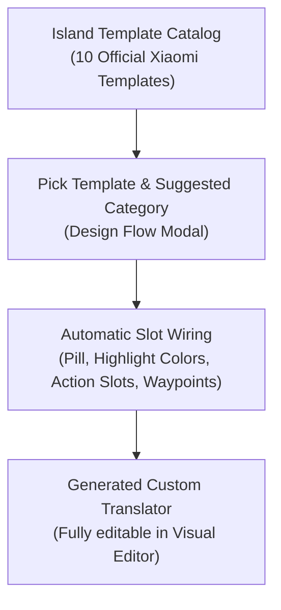

Starting with Hyper Bridge 0.6.0, you can display incoming notifications using **Xiaomi's 10 Official HyperIsland Layout Templates** (`IslandTemplateCatalog`).

Templates take the guesswork out of designing notification cards: each template provides a purpose-built visual architecture with optimal typography, progress elements, and button layouts optimized specifically for HyperOS 3 HyperIsland.

---

## 1. What is an Island Design?

In Hyper Bridge, an **Island Design** is a high-level notification translator whose presentation is configured using an official layout template (`PresentationMode.TEMPLATE`).

When you create a design:
1. You select a visual preset from the **Island Template Gallery**.
2. You pick which notification type (Navigation, Delivery, Calls, Media, Download, or Standard) should trigger it.
3. Hyper Bridge automatically generates an optimized rule and pre-wires all title variables, action slots, compact pill indicators, and accent colors.
4. You can keep it as-is or open it in the **Visual Editor** to tweak keywords, regex matching, or button behaviors!

---

## 2. The 10 Official Xiaomi Templates

The following table details all 10 official layout templates available in the in-app gallery:

| Template ID | Template Name | Suggested Type | Visual Card Style & Distinct Elements |
|---|---|---|---|
| `tpl_weather_nav` | **Weather & Navigation** | Navigation, Standard | **Context Header (`BASE_TYPE_1`)**: Small subtitle context line above an accented bold destination title, red accent color, and pill showing current milestone distance. |
| `tpl_payment_wallet` | **Payment & Wallet** | Messaging, Standard | **Transaction Card (`BASE_TYPE_2`)**: Large receipt header, payment total highlight, and built-in 1-tap **Copy Verification Code / OTP** action button. |
| `tpl_call_kit` | **Call Management** | Calls | **Call Card (`CALL`)**: Prominent caller avatar on the left, live duration chronometer, and circular green Accept and red Decline action buttons. |
| `tpl_ride_delivery` | **Ride & Delivery Tracker** | Progress, Standard | **Vehicle Waypoint Card**: Live delivery vehicle waypoint graphic moving along a route line, ETA text, and driver contact shortcuts. |
| `tpl_queue_wait` | **Queue & Wait Time** | Progress, Standard | **Queue Status Card**: Wait-time gauge, queue position badge, and accented progress bar indicating remaining wait time. |
| `tpl_parking_meter` | **Parking Meter** | Timers, Progress | **Countdown Card**: Real-time ticking chronometer displaying remaining parking duration, with quick extend actions. |
| `tpl_file_transfer` | **File Download / Transfer** | Downloads, Progress | **Download Progress Card**: Dynamic green percentage progress bar (`showPercentage = true`) and status pill displaying exact download percent (`78%`). |
| `tpl_promo_coupon` | **Promos & Coupons** | Standard | **Voucher Card**: Orange promotional highlight badge with a direct **View Deal / Open URL** smart button. |
| `tpl_boarding_pass` | **Boarding Pass & Travel** | Standard | **Travel Ticket Card**: Ticket-style layout drawn over a tinted background image, boarding gate information, and flight departure timer. |
| `tpl_courier_tracking` | **Courier & Parcel Tracking** | Progress, Standard | **Parcel Card**: Shipment checkpoint milestones with an integrated 1-tap **Track Package** smart action button. |

> [!TIP]
> **Compact Media Player (`tpl_media_compact`):**  
> In addition to the 10 gallery templates, Hyper Bridge includes the compact media template featuring album art masking, live artist and track titles, and audio playback controls.

---

## 3. Step-by-Step: Adding a Design in the App

Follow these steps to activate a template design in seconds:

### Step 1: Open the Add Design Flow
1. Navigate to the **Design** screen.
2. Tap the **`+` (Add)** FAB and choose **Custom Design** (or tap **`+`** on the **Designs** Bento card).

### Step 2: Choose Source
- Select **From Template Gallery** to browse the visual template presets.

### Step 3: Select Your Template
- Browse the interactive **Island Template Gallery**. Each card displays a true-to-life mockup of how Xiaomi HyperOS renders the card.
- Tap the template that fits your use case (e.g., *Ride & Delivery* or *Payment & Wallet*).

### Step 4: Choose the Notification Type
- Pick the category of notification you want this design to apply to:
  - **Messaging**: WhatsApp, Telegram, SMS, WeChat.
  - **Media**: Spotify, YouTube Music, Podcasts.
  - **Calls**: Phone, WhatsApp Call, Telegram Call.
  - **Downloads & Progress**: Google Play Store, browser downloads, cloud sync.
  - **Navigation**: Google Maps, Waze.
  - **Standard**: All other notifications.

### Step 5: Save & Enjoy!
- Tap **Create Design**. Hyper Bridge will instantly activate your design. The next time a matching notification arrives, it will present itself using your chosen template!

---

## 4. Managing & Customizing Designs (`DesignManagerScreen`)

To inspect and customize your designs:
1. Tap the **Designs** card on the Design Hub Bento Grid to enter the **Design Manager**.
2. **Interactive Preview**: Tap the preview switch to see how your active designs look on a live HyperOS HyperIsland mockup.
3. **Edit in Visual Editor**: Tap the **Edit (Pencil)** icon on any design card to modify matching conditions, target specific packages, change action buttons, or customize colors.
4. **Duplicate & Share**:
   - Tap **Duplicate** to create a modified clone of a design for a specific app.
   - Tap **Export** to save the design as a standalone `.htrans` file to share with friends or include in theme packs.
