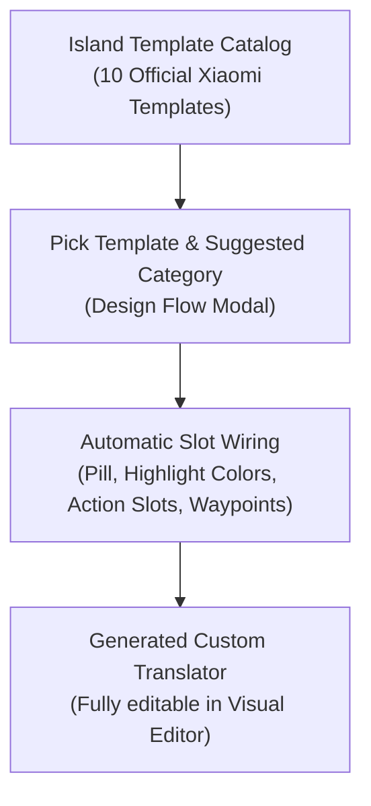

Starting with Hyper Bridge 0.6.0, you can display incoming notifications using **Xiaomi's 10 Official HyperIsland Layout Templates** (`IslandTemplateCatalog`).

Templates take the guesswork out of designing notification cards: each template provides a purpose-built visual architecture with optimal typography, progress elements, and button layouts optimized specifically for HyperOS 3 HyperIsland.

---

## 1. What is an Island Design?

In Hyper Bridge, an **Island Design** is a high-level notification translator whose presentation is configured using an official layout template (`PresentationMode.TEMPLATE`).

When you create a design:
1. You select a visual preset from the **Island Template Gallery**.
2. You pick which notification type (Navigation, Delivery, Calls, Media, Download, or Standard) should trigger it.
3. Hyper Bridge automatically generates an optimized rule and pre-wires all title variables, action slots, compact pill indicators, and accent colors.
4. You can keep it as-is or open it in the **Visual Editor** to tweak keywords, regex matching, or button behaviors!

---

## 2. The 10 Official Xiaomi Templates

The following table details all 10 official layout templates available in the in-app gallery:

| Template ID | Template Name | Suggested Type | Visual Card Style & Distinct Elements |
|---|---|---|---|
| `tpl_weather_nav` | **Weather & Navigation** | Navigation, Standard | **Context Header (`BASE_TYPE_1`)**: Small subtitle context line above an accented bold destination title, red accent color, and pill showing current milestone distance. |
| `tpl_payment_wallet` | **Payment & Wallet** | Messaging, Standard | **Transaction Card (`BASE_TYPE_2`)**: Large receipt header, payment total highlight, and built-in 1-tap **Copy Verification Code / OTP** action button. |
| `tpl_call_kit` | **Call Management** | Calls | **Call Card (`CALL`)**: Prominent caller avatar on the left, live duration chronometer, and circular green Accept and red Decline action buttons. |
| `tpl_ride_delivery` | **Ride & Delivery Tracker** | Progress, Standard | **Vehicle Waypoint Card**: Live delivery vehicle waypoint graphic moving along a route line, ETA text, and driver contact shortcuts. |
| `tpl_queue_wait` | **Queue & Wait Time** | Progress, Standard | **Queue Status Card**: Wait-time gauge, queue position badge, and accented progress bar indicating remaining wait time. |
| `tpl_parking_meter` | **Parking Meter** | Timers, Progress | **Countdown Card**: Real-time ticking chronometer displaying remaining parking duration, with quick extend actions. |
| `tpl_file_transfer` | **File Download / Transfer** | Downloads, Progress | **Download Progress Card**: Dynamic green percentage progress bar (`showPercentage = true`) and status pill displaying exact download percent (`78%`). |
| `tpl_promo_coupon` | **Promos & Coupons** | Standard | **Voucher Card**: Orange promotional highlight badge with a direct **View Deal / Open URL** smart button. |
| `tpl_boarding_pass` | **Boarding Pass & Travel** | Standard | **Travel Ticket Card**: Ticket-style layout drawn over a tinted background image, boarding gate information, and flight departure timer. |
| `tpl_courier_tracking` | **Courier & Parcel Tracking** | Progress, Standard | **Parcel Card**: Shipment checkpoint milestones with an integrated 1-tap **Track Package** smart action button. |

> [!TIP]
> **Compact Media Player (`tpl_media_compact`):**  
> In addition to the 10 gallery templates, Hyper Bridge includes the compact media template featuring album art masking, live artist and track titles, and audio playback controls.

---

## 3. Step-by-Step: Adding a Design from a Template

Follow these steps to activate a template design in seconds directly from the Design Bento Hub:

### Step 1: Open the Designs Manager & Add Design
Navigate to the **Design** screen and tap the **Designs** Bento card. If you don't have any active custom designs yet, you will be greeted by the Designs Manager empty state. Tap **Add Design** (or tap the **`+`** FAB and choose **Custom Design**).



---

### Step 2: Choose Design Creation Method
From the bottom sheet, select **From a template** to browse Xiaomi's official HyperIsland layout templates, or choose **Custom design** to create an empty canvas.



---

### Step 3: Browse the Island Template Picker
Browse the interactive catalog containing Xiaomi's 10 official HyperIsland templates. Each entry showcases the layout archetype (e.g. *Weather & Navigation*, *Payment & Wallet*, *Call Management*, *Ride & Delivery Tracker*).



---

### Step 4: Preview Template Layout
Tap any template to inspect its live preview, including its compact pill presentation, expanded island hierarchy, and default action button slots.



---

### Step 5: Configure Target Scope & Application
Set the target scope for this design. You can assign the template to a specific notification type (Navigation, Messaging, Media, Calls, Downloads & Progress, or Standard), or restrict it to specific applications.



---

### Step 6: Save & Manage Active Designs
Tap **Save Design**. Your new template-driven design is immediately registered and displayed in the **Designs Manager** with a live interactive HyperIsland preview toggle.



---

## 4. Editing & Customizing Design Properties

Every design created from a template is powered under the hood by Hyper Bridge's **Custom Translator Engine**. 


**Need to customize individual elements, regex matching, or button actions?**  
Custom designs share the exact same visual editing options as custom translators! To learn how to customize text variable tokens (`{notif.title}`, `{notif.text}`), regex patterns, compact pill slots, progress meters, action button intents, and themes, follow the complete **[Custom Translators User Guide]()**.


From the **Designs Manager**:
- **Edit in Visual Editor**: Tap the **Edit (Pencil)** icon on any active design card to open the complete visual editor.
- **Interactive Preview**: Tap the top switch to toggle between **Expanded Island** and **Compact Pill** previews in real-time.
- **Duplicate & Specialize**: Tap **Duplicate** to clone an existing template design for another app.
- **Export & Share**: Tap **Export** to save your design as a standalone `.htrans` file.
