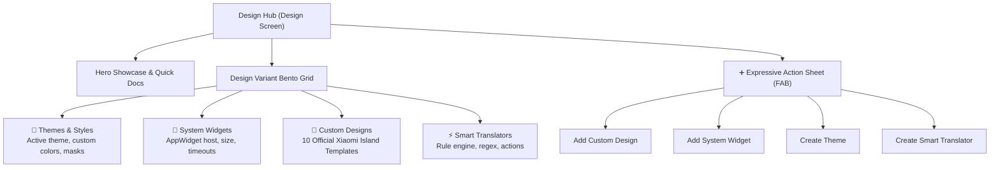

The **Design Hub** (`DesignScreen`) in Hyper Bridge 0.6.0 is your creative control center. Located in the bottom navigation bar alongside **Active Apps** and **Library**, the Design screen brings together all personalization aspects of your Xiaomi HyperOS Super Island experience in a unified Material 3 Expressive interface.

---

## 1. Navigating the Design Hub

When you switch to the **Design** tab, the screen is organized into clear visual zones:

### Top App Bar & Quick Settings
- **App Title**: Displays the current workspace status.
- **Settings Shortcut**: A top-right quick-action button provides instant access to **Global Settings**, island timeouts, diagnostics, and system setup guides.



### Hero Showcase Carousel
At the very top, a responsive hero carousel highlights key personalization features with interactive links:
- **Customization Guide**: Quick access to official styling documentation.
- **Theme Creator Pro**: Direct walkthrough for building and distributing `.hbr` and `.htheme` packages.
- **Community Discussions**: Connect directly with fellow creators on GitHub Discussions to share ideas, templates, and icons.

---

## 2. The Bento Grid: What Each Section Does

Directly below the hero carousel sits the **Design Variant Bento Grid** — four distinct modular cards that display real-time status and provide one-tap access to your customization libraries.

| Bento Card | Active Status Displayed | Card Tap Action | Action Button Tap |
|---|---|---|---|
| **🎨 Themes & Styles** | Displays active theme name (or "Default") | Opens **Theme Manager** | Launches **In-App Theme Creator** (`+`) |
| **🧩 System Widgets** | Displays number of saved widgets | Opens **Saved App Widgets** list | Opens **Widget Picker Sheet** (`+`) |
| **📐 Custom Designs** | Shows active template design count | Opens **Design Manager** gallery | Opens **Add Design Flow** modal |
| **⚡ Translators** | Shows active custom translator count | Opens **Translator Manager** | Launches **Translator Visual Editor** |

---

## 3. The Central FAB (`+` Add Action Sheet)

Tapping the prominent **Floating Action Button (`+`)** in the bottom-right corner reveals an expressive Material 3 modal sheet with four core creation pathways:



1. **Custom Design**: Choose from official Xiaomi Super Island layout presets (delivery waypoints, payment cards, timers, boarding passes) and bind them to your notification channels.
2. **System Widget**: Browse all Android widgets installed on your device (Spotify, weather, calendar, clock) and mount them directly inside your HyperOS Super Island.
3. **Theme & Styles**: Create a new visual style, adjusting primary accents, call button designs, icon padding, and geometric shapes.
4. **Smart Translator**: Launch the comprehensive declarative rule builder to intercept, reformat, and enhance notifications with regex, custom actions, and smart buttons.

---

## 4. Featured & Community Section

Below the Bento Grid, the Design Hub showcases:
- **Active Designs Carousel**: Scroll through your enabled template cards and preview how they appear in expanded and compact status bar states.
- **Installed Themes**: Quickly switch between installed `.htheme` / `.hbr` theme packs with a single tap.
- **Guides & Video Tutorials**: In-app links to help documentation, permission guides, and the troubleshooting diagnostics console.

---

## Next Steps

- Learn how to use the built-in [In-App Theme Creator]().
- Explore [Island Templates & Designs]() to see all 10 official Xiaomi presets.
- Add your favorite Android home-screen widgets to the island with the [System Widgets Guide]().
- Build advanced regex rules and action slots with the [Custom Translators Guide]().
