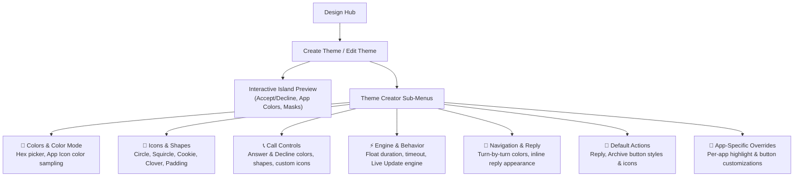

This guide covers how to customize and create themes using the **In-App Theme Creator** in Hyper Bridge:
- Build, preview, and customize colors, geometric masks, call styles, and engine behaviors directly on your device.
- Export your creations or import themes shared by the community.


**Looking for the developer package specification or Android Intent API?**  
See the [Theme Packaging Specification (.hbr)]() in the Advanced & Developer documentation.


---

## Visual Theme Creator (In-App)

Hyper Bridge 0.6.0 includes a full-featured **Visual Theme Creator** (`ThemeCreatorScreen`). You can build, preview, edit, and apply beautiful custom island themes directly on your phone without touching JSON or ZIP files.

### 1. Launching the Theme Creator
- **From Design Hub**: Tap the **`+` (Add)** FAB and select **Theme & Styles**, or tap the `+` action on the **Themes** Bento card.
- **From Theme Manager**: Open **Themes & Styles** &rarr; tap the floating action button to create a new theme, or tap the **Edit (Pencil)** icon on any installed theme to customize it.

---

### 2. Live Interactive Preview
At the top of the Theme Creator, a live **HyperOS Super Island Preview** renders your adjustments instantly:
- Watch call answer/decline button shapes and colors change as you pick them.
- See how app icon padding and geometric corner radiuses look against the dark island canvas.
- Toggle between dark, light, or accent states in real time.

---

### 3. Understanding the Theme Creator Modules

The creator organizes theme properties into modular, focused subscreens:

#### 🎨 Colors & Color Mode (`CreatorRoute.COLORS`)
- **Highlight Color**: The primary accent color for progress bars, highlights, and status badges (e.g. Electric Cyan `#00FFDD`, Sunset Orange `#FF6900`, Lime `#34C759`).
- **Color Mode**:
  - **Custom Color**: Uses your designated hex highlight color across all applications.
  - **App Icon Color (Dynamic Extraction)**: Automatically extracts and applies the dominant color from each notification app's icon for a dynamic, tailored feel.

#### 📐 Icons & Shapes (`CreatorRoute.ICONS`)
- **Icon Shape Mask**: Pick the geometric mask applied to notification icons:
  - `circle`: Traditional smooth circular mask.
  - `squircle`: Modern continuous-curvature squircle matching HyperOS design.
  - `cookie`: Playful scallop-edged cookie shape.
  - `clover8`: 8-petal clover geometry.
  - `square` / `arch`: Sharp or arched framing.
- **Icon Inner Padding (0% to 30%)**: Adjust breathing room between the icon graphic and the geometric boundary.

#### 📞 Calls Style (`CreatorRoute.CALLS`)
- **Answer Button**: Set custom button background color (default `#34C759`), geometric shape mask, and optional custom call answer PNG icon.
- **Decline Button**: Set custom button background color (default `#FF3B30`), geometric shape mask, and optional custom call decline PNG icon.

#### ⚡ Behavior & Engine Motor (`CreatorRoute.BEHAVIOR_MENU`)
- **Engine Selection**: Toggle between **Custom Island** (Hyper Bridge's native floating island motor) and **Native Live Update** (Xiaomi's official live channel).
- **Float & Dismissal Timeouts**: Configure default display durations before the expanded island card collapses into the compact pill.

#### 🧭 Navigation & Inline Reply
- **Navigation Layout (`CreatorRoute.NAVIGATION`)**: Adjust waypoint colors, swap left/right turn indicator positions, and assign custom arrow/flag icons for turn-by-turn guidance.
- **Inline Reply (`CreatorRoute.REPLY`)**: Customize the input field background, placeholder text, and send button styling for interactive island replies.

#### 🔘 Default Actions & App Overrides
- **Default Actions (`CreatorRoute.ACTIONS`)**: Set default visual modes for standard actions (`ICON`, `TEXT`, or `ICON_AND_TEXT`) and assign custom graphic assets.
- **App-Specific Customizations (`CreatorRoute.APPS`)**: Override any color, action button, or icon mask for individual applications (e.g., WhatsApp in Emerald Green, Spotify in Black & Neon).

---

### 4. Saving & Applying Your Theme
1. Tap the **Save** button in the top-right corner.
2. In the dialog:
   - **Save & Apply**: Immediately activates your new theme as the default system style.
   - **Save Only**: Saves the theme to your library without applying it.
3. Your theme is saved locally and can be exported as an `.hbr` package at any time!

---

## Exporting, Importing & Sharing Themes

Hyper Bridge makes it easy to back up, share, and import themes without touching code:

### Exporting an In-App Theme
1. Navigate to **Design Hub** &rarr; **Themes & Styles**.
2. Tap the menu (**⋮**) or the **Export** icon on any custom theme card.
3. Choose a destination folder using Android's file picker. Hyper Bridge generates an `.hbr` theme package containing all your colors, button rules, and bundled translators.

### Importing a Community Theme
1. Download any `.hbr` or `.htheme` file from the community, Discord, Telegram, or GitHub.
2. In Hyper Bridge, go to **Design Hub** &rarr; **Themes & Styles** and tap **Import Theme** in the top bar.
3. Select your `.hbr` file. Hyper Bridge will preview the theme palette and install it into your library with one tap.

---

## Packaging Themes for Distribution (Developers)

If you are an icon pack developer, designer, or Android modder interested in:
- Manually creating `.hbr` / `.htheme` ZIP packages with custom icons,
- Bundling custom `.htrans` translators inside your theme,
- Triggering 1-tap theme installation from your companion Android app via `com.d4viddf.hyperbridge.APPLY_THEME` intents,

Please refer to the dedicated **[Theme Packaging Specification (.hbr)]()** in the Advanced & Developer documentation.

---

## Next Steps

- Browse the official [10 Xiaomi Island Templates]() to see how themes render across delivery, music, and boarding pass cards.
- Add live home-screen widgets into your islands with the [System Widgets Guide]().
- Create custom notification rules with the [Custom Translators Guide]().
