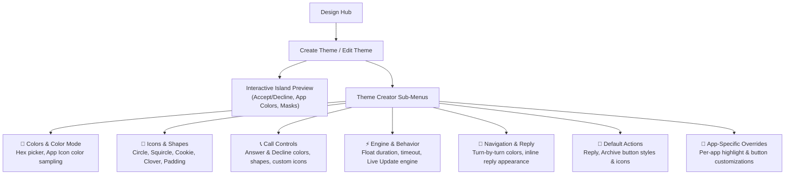

This guide covers how to customize and create themes using the **In-App Theme Creator** in Hyper Bridge:
- Build, preview, and customize colors, geometric masks, call styles, and engine behaviors directly on your device.
- Export your creations or import themes shared by the community.


**Looking for the developer package specification or Android Intent API?**  
See the [Theme Packaging Specification (.hbr)]() in the Advanced & Developer documentation.


---

## Visual Theme Creator (In-App)

Hyper Bridge 0.6.0 includes a full-featured **Visual Theme Creator** (`ThemeCreatorScreen`). You can build, preview, edit, and apply beautiful custom island themes directly on your phone without touching JSON or ZIP files.

### 1. Accessing Theme Management

Open **Design Hub** &rarr; tap the **Themes & Styles** Bento card:



From here you can:
- **Switch Active Theme:** Tap any theme card to activate it immediately.
- **Manage Custom Themes:** Tap the **Edit (Pencil)** icon to modify an existing theme, **Share** to export as an `.hbr` bundle, or **Trash** to delete it.
- **Add New Theme:** Tap the **`+` (Floating Action Button)** in the bottom right corner:



Choose **Create New Theme** to launch the visual studio, **Import** to load a local `.hbr`/`.htheme` archive, or **Search** to browse community creations.

---

### 2. The Theme Creator Studio Overview

When you create or edit a theme, the **Theme Creator Studio** (`ThemeCreatorScreen`) opens with an interactive live canvas at the top:



#### Theme Info & Metadata
Tap **Edit Theme Info** to brand your creation:



- **Select Icon:** Pick an emblem or custom artwork for your theme card.
- **Theme Name & Author Name:** Give your theme a distinctive identity.
- **Description:** Add release notes or styling tips.

---

### 3. Step-by-Step Theme Modules

The creator organizes theme properties into modular, focused subscreens:

#### ⚡ Behavior & Triggers (`CreatorRoute.BEHAVIOR_MENU`)
Configure how the notification engine treats this theme:



- **Engine:** Switch between **Live Updates (Custom Island Engine)** and **Native Xiaomi Live Updates**.
- **Island Behavior:** Fine-tune auto-dismiss durations, duplicate handling, and lock screen visibility.
- **Notification Types:** Choose which event categories trigger islands for this theme.

---

#### 🎨 Colors & Color Mode (`CreatorRoute.COLORS`)
Define the visual color palette across your island:



- **Preset Colors:** Tap quick accent swatches (Green, Red, Blue, Orange, Purple).
- **Dynamic Colors:**
  - **Use App Colors:** Automatically extracts and applies the dominant color from each notification app's icon for a customized look.
  - **Material You (System):** Extracts tonal palettes directly from your Android wallpaper.
- **Custom Color Picker:** Tap the **Custom** tab to choose any precise hex code:



---

#### 📐 Icons & Shapes (`CreatorRoute.ICONS`)
Style the geometric framing and proportions of notification avatars and status indicators:



- **Icon Size Slider:** Scale notification icons between full-bleed and compact minimalism.
- **Live State Previews:** Swipe horizontally on the preview card at the top to see your changes across notifications, calls, and media:



- **Navigation & Progress Icons:** Choose custom vector glyphs for turn-by-turn guidance and completion badges:



- **Geometric Mask Picker:** Apply custom corner masks to all icons:



---

#### 📞 Call Controls Style (`CreatorRoute.CALLS`)
Customize incoming and ongoing phone call cards:



- **Answer Button:** Configure custom hex colors (default `#34C759`) and geometric masks.
- **Decline Button:** Configure end-call accents (default `#FF3B30`) and button shapes:



---

#### 🧭 Navigation Layout (`CreatorRoute.NAVIGATION`)
Fine-tune turn-by-turn GPS heads-up islands:



- **Left Side:** Distance & Remaining Time.
- **Right Side:** Maneuver instruction (e.g., Turn Right).
- *Note:* In the Native Live Update engine, right-side content is prioritized to maintain status bar alignment.

---

#### 🔘 Global Actions & Quick Buttons (`CreatorRoute.ACTIONS`)
Configure smart action buttons attached to notifications (such as Reply, Archive, Like, Mark as Read):



Tap the **`+` (Add Action)** button to create keyword matching rules:



- **Keyword Matching:** Enter keywords (e.g. `'Reply'`, `'Archive'`, `'Skip'`).
- **Display Mode:** Choose between **Icon Only**, **Text**, or **Both**.
- **Colors:** Set custom button background and text/icon contrast colors.

---

#### 📱 Per-App Custom Overrides (`CreatorRoute.APPS`)
Override theme rules for specific individual applications:



Tap **`+`** to select an app from your device:



You can assign unique highlight colors, distinct geometric shapes, or special button layouts for specific apps (e.g., WhatsApp in emerald green, Spotify in neon green, YouTube Music in crimson).

---

### 4. Saving & Applying Your Theme
1. Tap the **Save** button in the top-right corner of the studio.
2. In the dialog:
   - **Save & Apply**: Immediately activates your new theme as the default system style.
   - **Save Only**: Saves the theme to your library without applying it.
3. Your theme is saved locally and can be exported as an `.hbr` package at any time!

---

## Exporting, Importing & Sharing Themes

Hyper Bridge makes it easy to back up, share, and import themes without touching code:

### Exporting an In-App Theme
1. Navigate to **Design Hub** &rarr; **Themes & Styles**.
2. Tap the menu (**⋮**) or the **Export** icon on any custom theme card.
3. Choose a destination folder using Android's file picker. Hyper Bridge generates an `.hbr` theme package containing all your colors, button rules, and bundled translators.

### Importing a Community Theme
1. Download any `.hbr` or `.htheme` file from the community, Discord, Telegram, or GitHub.
2. In Hyper Bridge, go to **Design Hub** &rarr; **Themes & Styles** and tap **Import Theme** in the top bar.
3. Select your `.hbr` file. Hyper Bridge will preview the theme palette and install it into your library with one tap.

---

## Packaging Themes for Distribution (Developers)

If you are an icon pack developer, designer, or Android modder interested in:
- Manually creating `.hbr` / `.htheme` ZIP packages with custom icons,
- Bundling custom `.htrans` translators inside your theme,
- Triggering 1-tap theme installation from your companion Android app via `com.d4viddf.hyperbridge.APPLY_THEME` intents,

Please refer to the dedicated **[Theme Packaging Specification (.hbr)]()** in the Advanced & Developer documentation.

---

## Next Steps

- Browse the official [10 Xiaomi Island Templates]() to see how themes render across delivery, music, and boarding pass cards.
- Add live home-screen widgets into your islands with the [System Widgets Guide]().
- Create custom notification rules with the [Custom Translators Guide]().
