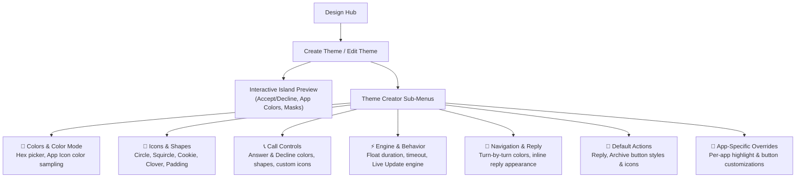

This guide covers everything you need to create and customize themes for **Hyper Bridge**:
1. **[Part A: In-App Theme Creator](#part-a-in-app-theme-creator-no-code)** — The visual editor built directly inside the Hyper Bridge app for normal users.
2. **[Part B: Theme Package Specification (`.hbr` / `.htheme`)](#part-b-theme-package-specification-hbr--htheme)** — The ZIP archive structure, JSON contract, custom translator bundling, and Intent APIs for icon pack developers and third-party launchers.

---

## **Part A: In-App Theme Creator (No-Code)**

Hyper Bridge 0.6.0 includes a full-featured **Visual Theme Creator** (`ThemeCreatorScreen`). You can build, preview, edit, and apply beautiful custom island themes directly on your phone without touching JSON or ZIP files.



### 1. Launching the Theme Creator
- **From Design Hub**: Tap the **`+` (Add)** FAB and select **Theme & Styles**, or tap the `+` action on the **Themes** Bento card.
- **From Theme Manager**: Open **Themes & Styles** &rarr; tap the floating action button to create a new theme, or tap the **Edit (Pencil)** icon on any installed theme to customize it.

---

### 2. Live Interactive Preview
At the top of the Theme Creator, a live **HyperOS Super Island Preview** renders your adjustments instantly:
- Watch call answer/decline button shapes and colors change as you pick them.
- See how app icon padding and geometric corner radiuses look against the dark island canvas.
- Toggle between dark, light, or accent states in real time.

---

### 3. Understanding the Theme Creator Modules

The creator organizes theme properties into modular, focused subscreens:

#### 🎨 Colors & Color Mode (`CreatorRoute.COLORS`)
- **Highlight Color**: The primary accent color for progress bars, highlights, and status badges (e.g. Electric Cyan `#00FFDD`, Sunset Orange `#FF6900`, Lime `#34C759`).
- **Color Mode**:
  - **Custom Color**: Uses your designated hex highlight color across all applications.
  - **App Icon Color (Dynamic Extraction)**: Automatically extracts and applies the dominant color from each notification app's icon for a dynamic, tailored feel.

#### 📐 Icons & Shapes (`CreatorRoute.ICONS`)
- **Icon Shape Mask**: Pick the geometric mask applied to notification icons:
  - `circle`: Traditional smooth circular mask.
  - `squircle`: Modern continuous-curvature squircle matching HyperOS design.
  - `cookie`: Playful scallop-edged cookie shape.
  - `clover8`: 8-petal clover geometry.
  - `square` / `arch`: Sharp or arched framing.
- **Icon Inner Padding (0% to 30%)**: Adjust breathing room between the icon graphic and the geometric boundary.

#### 📞 Calls Style (`CreatorRoute.CALLS`)
- **Answer Button**: Set custom button background color (default `#34C759`), geometric shape mask, and optional custom call answer PNG icon.
- **Decline Button**: Set custom button background color (default `#FF3B30`), geometric shape mask, and optional custom call decline PNG icon.

#### ⚡ Behavior & Engine Motor (`CreatorRoute.BEHAVIOR_MENU`)
- **Engine Selection**: Toggle between **Custom Island** (Hyper Bridge's native floating island motor) and **Native Live Update** (Xiaomi's official live channel).
- **Float & Dismissal Timeouts**: Configure default display durations before the expanded island card collapses into the compact pill.

#### 🧭 Navigation & Inline Reply
- **Navigation Layout (`CreatorRoute.NAVIGATION`)**: Adjust waypoint colors, swap left/right turn indicator positions, and assign custom arrow/flag icons for turn-by-turn guidance.
- **Inline Reply (`CreatorRoute.REPLY`)**: Customize the input field background, placeholder text, and send button styling for interactive island replies.

#### 🔘 Default Actions & App Overrides
- **Default Actions (`CreatorRoute.ACTIONS`)**: Set default visual modes for standard actions (`ICON`, `TEXT`, or `ICON_AND_TEXT`) and assign custom graphic assets.
- **App-Specific Customizations (`CreatorRoute.APPS`)**: Override any color, action button, or icon mask for individual applications (e.g., WhatsApp in Emerald Green, Spotify in Black & Neon).

---

### 4. Saving & Applying Your Theme
1. Tap the **Save** button in the top-right corner.
2. In the dialog:
   - **Save & Apply**: Immediately activates your new theme as the default system style.
   - **Save Only**: Saves the theme to your library without applying it.
3. Your theme is saved locally and can be exported as an `.hbr` package at any time!

---

## **Part B: Theme Package Specification (`.hbr` / `.htheme`)**

For designers, icon pack developers, and theme stores distributing standalone packages, Hyper Bridge defines a strict packaging standard.

Themes are distributed as **Hyper Bridge Packages** (`.hbr` or `.htheme`), which are standard ZIP archives containing a specific folder structure and configuration file. Whether a user downloads the file manually or applies it via your app, the internal structure must be identical.

### **File Structure**

Organize your theme assets as follows before zipping:

```Plaintext  
my_theme_project
│  
├── theme_config.json        <-- The Brain (Metadata + Rules)  
│  
├── icons/                   <-- Action icons (48x48px PNG suggested)  
│   ├── ic_reply.png  
│   ├── ic_archive.png  
│   └── ic_heart.png  
│  
├── status/                  <-- Progress & Navigation icons  
│   ├── nav_arrow.png  
│   └── download_tick.png  
│  
├── translators/             <-- [NEW] Bundled Custom Translators (.htrans or .json)
│   ├── spotify_enhanced.htrans  
│   └── whatsapp_vip.json  
│  
└── global/                  <-- Backgrounds or overlays (Optional)  
    └── island_glow.png
```

**Note:** Once built, rename the `.zip` file to `.hbr` (e.g., `neon_theme.hbr`).

---

## **2. Bundling Custom Translators (New in v0.6.0)**


**Ship custom behaviors with your visual style:** Theme packs can bundle complete notification translation rules directly in the `translators/` folder!


When Hyper Bridge installs a theme (`.hbr` or `.htheme`), it automatically scans for a `translators/` directory:
- Any **`.htrans`** packages (ZIP archives containing `translator.json` and custom icons) or standalone **`.json`** translator files found inside are automatically unpacked and registered into the user's database.
- The bundled translators can link to your theme's highlight colors, override notification actions, inject [Smart Actions](), and apply custom templates (e.g., music playback cards, delivery trackers, VIP chat designs).
- Learn how to build and configure translators in the [Custom Translators Guide]() and the [Translators Technical Specification]().

---

## **3. Configuration (theme_config.json)**

The `theme_config.json` maps your image files to HyperBridge logic.

### **JSON Specification**

```JSON  
{
  "id": "acquatheme",
  "meta": {
    "name": "Neon Cyberpunk",
    "author": "PixelMaster",
    "version": 2,
    "description": "A high contrast neon theme with custom shapes and smart rules."
  },
  "global": {
    "highlight_color": "#00FFDD",
    "background_color": "#202124",
    "text_color": "#FFFFFF",
    "use_app_colors": false,          // If true, dynamic colors from app icon override highlight_color
    "icon_shape_id": "cookie",        // Options: circle, square, squircle, cookie, arch, clover8
    "icon_padding_percent": 15
  },
  "call_config": {
    "answer_color": "#34C759",
    "decline_color": "#FF3B30",
    "answer_shape_id": "circle",      // Shape override for answer button
    "decline_shape_id": "circle",     // Shape override for decline button
    "answer_icon": {
      "type": "LOCAL_FILE",
      "value": "icons/call_answer.png"
    },
    "decline_icon": {
      "type": "LOCAL_FILE",
      "value": "icons/call_decline.png"
    }
  },
  "default_actions": {
    "reply": {
      "mode": "ICON",                 // Options: ICON, TEXT, BOTH
      "background_color": "#3300FFDD",// Hex color for button background
      "tint_color": "#00FFDD",        // Hex color for icon/text tint
      "icon": {
        "type": "LOCAL_FILE",
        "value": "icons/ic_reply.png"
      }
    },
    "archive": {
      "mode": "ICON",
      "icon": {
        "type": "LOCAL_FILE",
        "value": "icons/ic_archive.png"
      }
    }
  },
  "default_progress": {
    "active_color": "#FF0099",
    "finished_color": "#34C759",
    "show_percentage": true,
    "active_icon": {                  // Icon displayed while progress is running
        "type": "LOCAL_FILE",
        "value": "status/downloading.png"
    },
    "finished_icon": {                // Icon displayed when progress completes
        "type": "LOCAL_FILE",
        "value": "status/download_tick.png"
    }
  },
  "default_navigation": {
    "progress_bar_color": "#00FFDD",
    "swap_sides": false,
    "pic_forward": {
        "type": "LOCAL_FILE",
        "value": "nav/arrow_straight.png"
    },
    "pic_end": {
        "type": "LOCAL_FILE",
        "value": "nav/destination_flag.png"
    }
  },
  "apps": {
    "com.whatsapp": {
      "highlight_color": "#25D366",   // App-specific override
      "actions": {
        "reply": {
          "mode": "BOTH",
          "tint_color": "#FFFFFF",
          "background_color": "#25D366",
          "icon": {
            "type": "LOCAL_FILE",
            "value": "icons/ic_reply_whatsapp.png"
          }
        }
      }
    }
  }
}
```
---

## **4. Applying the Theme (Intent Code)**

To apply the theme programmatically from your app, you must send the `.hbr` file via a specific Android Intent. This requires saving the file to your cache (so it is accessible) and sharing it via FileProvider.

### **Prerequisites**

1. **File Extension:** Ensure the file ends in `.hbr`, `.htheme`, or `.zip`.  
2. **MIME Type:** Use `application/zip` or `application/octet-stream`.  
3. **Permissions:** The `FLAG_GRANT_READ_URI_PERMISSION` is critical.

### **Kotlin Implementation**

Copy this function into your app to handle the "Apply" button click:

```Kotlin  
import android.content.Context  
import android.content.Intent  
import androidx.core.content.FileProvider  
import java.io.File

fun applyThemeToHyperBridge(context: Context) {  
    try {  
        // 1. Locate your theme file (e.g., copy from assets to cache)  
        // If your theme is in 'assets/neon_theme.hbr':  
        val themeFile = File(context.cacheDir, "neon_theme.hbr")  
          
        if (!themeFile.exists()) {  
            context.assets.open("neon_theme.hbr").use { input ->  
                themeFile.outputStream().use { output -> input.copyTo(output) }  
            }  
        }

        // 2. Create the URI using FileProvider  
        // Ensure you have a FileProvider defined in your AndroidManifest.xml  
        val uri = FileProvider.getUriForFile(  
            context,  
            "${context.packageName}.provider",  
            themeFile  
        )

        // 3. Send the Intent to HyperBridge  
        val intent = Intent("com.d4viddf.hyperbridge.APPLY_THEME").apply {  
            setDataAndType(uri, "application/zip")  
            addFlags(Intent.FLAG_GRANT_READ_URI_PERMISSION)  
            addFlags(Intent.FLAG_ACTIVITY_NEW_TASK)  
        }

        // 4. Launch  
        context.startActivity(intent)

    } catch (e: Exception) {  
        // HyperBridge is likely not installed or the file failed to copy  
        e.printStackTrace()  
        // TODO: Prompt user to install HyperBridge  
    }  
}
```

### **Flutter Implementation**

For Flutter, use the `android_intent_plus` package (or similar) to construct the specific intent:

```Dart  
import 'dart:io';  
import 'package:android_intent_plus/android_intent.dart';  
import 'package:path_provider/path_provider.dart';  

Future<void> applyTheme() async {  
  final dir = await getTemporaryDirectory();  
  final filePath = '${dir.path}/neon_theme.hbr';  
    
  // (Ensure file exists at filePath...)

  final intent = AndroidIntent(  
    action: 'com.d4viddf.hyperbridge.APPLY_THEME',  
    type: 'application/zip',  
    data: Uri.parse('content://$filePath').toString(),  
    flags: <int>[  
      0x00000001, // FLAG_GRANT_READ_URI_PERMISSION  
      0x10000000, // FLAG_ACTIVITY_NEW_TASK  
    ],  
  );

  await intent.launch();  
}
```

---

## **5. Summary of the Public API**

| Component | Specification |
| :---- | :---- |
| **Structure** | Folder with `theme_config.json`, `icons/` folder, and optional `translators/` folder. |
| **Package** | ZIP format, renamed to `.hbr` or `.htheme`. |
| **Custom Translators** | Optional `translators/` folder containing `.htrans` or `.json` files. |
| **Intent Action** | `com.d4viddf.hyperbridge.APPLY_THEME` |
| **Data Type** | `application/zip` |
| **Security** | Requires FileProvider URI + Read Permission Flag. |

This format is universal. A `.hbr` file created for this intent can also be uploaded to Telegram, Discord, GitHub, or shared directly for users to install via the Hyper Bridge "Import" menu.
