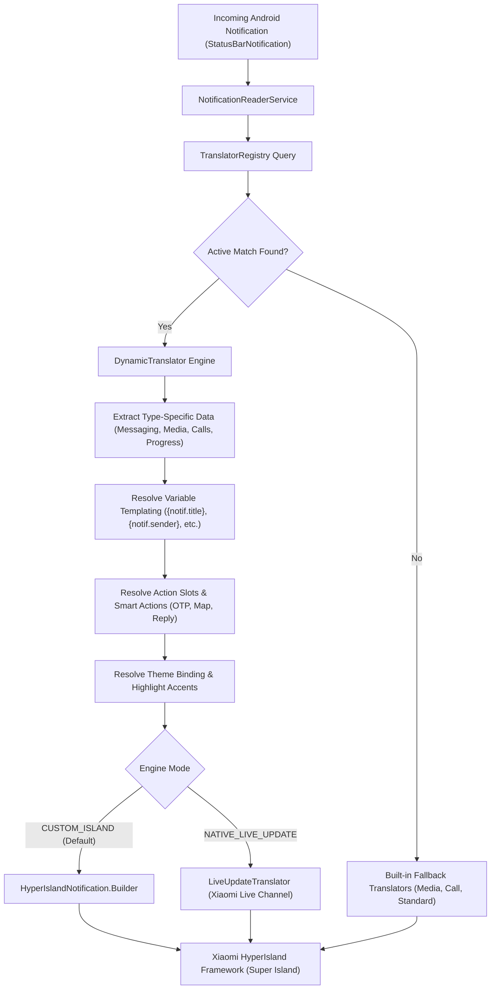

This document provides the authoritative technical reference for the **Custom Translators Framework** (`.htrans`) in Hyper Bridge 0.6.0. It is designed for developers, theme authors, and power users building custom notification pipelines, automation tools, or community packages.

---

## Architectural Overview

Hyper Bridge operates as an event-driven translation engine that intercepts incoming `StatusBarNotification` events from the Android Notification Listener Service and transforms them into native Xiaomi HyperOS Super Island specifications.



### Interception Pipeline Rules
1. **Allowlist Bypass:** If a Custom Translator explicitly targets a specific package (via `SPECIFIC_APPS` or `SYSTEM_APPS`), the application **bypasses the global app allowlist**. It is processed even if the user has not enabled the app in the global library list.
2. **Evaluation Precedence:** The in-memory `TranslatorRegistry` indexes all active rules into prioritized buckets:
   $$\text{SPECIFIC\_APPS} \succ \text{SYSTEM\_APPS} \succ \text{NOTIFICATION\_TYPE} \succ \text{GLOBAL}$$
   Within each scope tier, translators are evaluated in descending order of their `priority` integer (e.g. `200` executes before `100`).
3. **Short-Circuit Evaluation:** The first translator whose `TranslatorConditions` and `TypeSpecificConditions` evaluate to `true` claims the notification.

---

## The `.htrans` Package Anatomy

A Custom Translator can be packaged as a single `.htrans` archive or distributed as a raw `.json` file.

```text
my_translator.htrans (ZIP Archive)
├── translator.json        (Required: Schema definition)
└── icons/                 (Optional: Custom graphics)
    ├── ic_custom_action.png
    └── ic_badge.webp
```

### Packaging & Security Specifications
- **ZIP Container:** Standard Deflate-compressed ZIP container renamed to `.htrans`.
- **Zip-Slip Protection:** When extracting, the `TranslatorRepository` validates every canonical entry path against the target directory to prevent directory traversal attacks.
- **Internal Storage Location:** Extracted icon assets are stored locally under:
  ```text
  context.filesDir/translators/{translator_id}/icons/
  ```
- **Theme Bundling:** Themes (`.htheme` / `.hbr`) can bundle translators in a root `translators/` directory:
  ```text
  neon_theme.htheme (ZIP Archive)
  ├── theme.json
  └── translators/
      ├── spotify_enhanced.htrans
      └── delivery_tracker.json
  ```

---

## Complete JSON Schema Reference

### 1. Root: `CustomTranslator`

| Field | Type | Default | Description |
|---|---|---|---|
| `id` | `String` | *(Required)* | Unique identifier (e.g. `com.example.whatsapp.vip`). |
| `meta` | `TranslatorMetadata` | *(Required)* | Human-readable metadata and author information. |
| `target_scope` | `TargetScope` | `SPECIFIC_APPS` | Scope tier for evaluation order (`GLOBAL`, `SPECIFIC_APPS`, `SYSTEM_APPS`, `NOTIFICATION_TYPE`). |
| `target_packages` | `List<String>` | `[]` | Android package names when scope is `SPECIFIC_APPS` or `SYSTEM_APPS`. |
| `target_notification_types` | `List<String>` | `[]` | Notification category strings when scope is `NOTIFICATION_TYPE` (e.g. `MESSAGING`, `MEDIA`). |
| `priority` | `Int` | `100` | Evaluation priority (higher numbers execute first). |
| `is_enabled` | `Boolean` | `true` | Master active toggle for the translator. |
| `conditions` | `TranslatorConditions` | `{}` | Pattern-matching rules and criteria. |
| `theme_binding` | `ThemeBinding` | `{}` | Accent color, icon mask, and theme linkages. |
| `engine_mode` | `EngineMode` | `INHERIT` | Island rendering engine (`INHERIT`, `CUSTOM_ISLAND`, `NATIVE_LIVE_UPDATE`). |
| `behavior_override` | `BehaviorOverride` | `{}` | Timeout, floating banner, and dismissibility overrides. |
| `data_extraction` | `DataExtractionConfig` | `{}` | Regex rules for parsing progress percentages. |
| `presentation` | `PresentationConfig` | `{}` | Visual layout, text templates, action slots, and compact pill config. |

---

### 2. `TranslatorMetadata`

| Field | Type | Default | Description |
|---|---|---|---|
| `name` | `String` | *(Required)* | Display title of the translator. |
| `author` | `String` | `"Community"` | Author name or handle. |
| `version` | `Int` | `1` | Schema revision integer. |
| `description` | `String` | `""` | Brief description of what the translator does. |
| `icon_name` | `String` | `"AutoAwesome"` | Name of the Material icon displayed in the manager list. |
| `share_link` | `String?` | `null` | Optional URL to community repo or documentation. |

---

### 3. `TargetScope` Enum

| Value | Evaluation Order | Description |
|---|---|---|
| `SPECIFIC_APPS` | **1st (Highest)** | Evaluates exclusively against notifications from packages in `target_packages`. |
| `SYSTEM_APPS` | **2nd** | Evaluates explicitly targeted system packages (bypasses default system filter). |
| `NOTIFICATION_TYPE` | **3rd** | Evaluates against specific categories (`MESSAGING`, `MEDIA`, `CALLS`, `PROGRESS`). |
| `GLOBAL` | **4th (Lowest)** | Evaluates across all notifications on the device matching regex conditions. |

---

### 4. `TranslatorConditions`

| Field | Type | Default | Description |
|---|---|---|---|
| `title_regex` | `String?` | `null` | Regular expression matched against `Notification.EXTRA_TITLE`. |
| `text_regex` | `String?` | `null` | Regular expression matched against `Notification.EXTRA_TEXT`. |
| `subtext_regex` | `String?` | `null` | Regular expression matched against `Notification.EXTRA_SUB_TEXT`. |
| `category` | `String?` | `null` | Android notification category string (e.g. `CATEGORY_MESSAGE`, `CATEGORY_CALL`). |
| `channel_id` | `String?` | `null` | Exact NotificationChannel ID. |
| `has_extras` | `List<String>` | `[]` | Required bundle keys that must be present in `notification.extras`. |
| `has_actions` | `Boolean?` | `null` | If `true`, notification must contain at least one `Notification.Action`. |
| `has_progress` | `Boolean?` | `null` | If `true`, notification must define `EXTRA_PROGRESS` or match progress regex. |
| `type_specific_conditions` | `TypeSpecificConditions?` | `null` | Domain-specific extractors for Messaging, Media, Calls, and Navigation. |

---

### 5. `TypeSpecificConditions`

#### A. Messaging (`messaging`)
| Field | Type | Default | Description |
|---|---|---|---|
| `sender_name_regex` | `String?` | `null` | Regex matched against extracted contact name (`Person.getName()` or `EXTRA_MESSAGING_PERSON`). |
| `conversation_title_regex` | `String?` | `null` | Regex matched against group chat conversation title (`EXTRA_CONVERSATION_TITLE`). |
| `is_group_conversation` | `Boolean?` | `null` | Filter based on whether the message is from a group chat. |

#### B. Media (`media`)
| Field | Type | Default | Description |
|---|---|---|---|
| `artist_regex` | `String?` | `null` | Regex matched against artist in `MediaMetadataCompat`. |
| `album_regex` | `String?` | `null` | Regex matched against album name. |
| `is_playing` | `Boolean?` | `null` | Matches playback state (`PlaybackStateCompat.STATE_PLAYING`). |

#### C. Calls (`call`)
| Field | Type | Default | Description |
|---|---|---|---|
| `caller_name_regex` | `String?` | `null` | Regex matched against caller identification. |
| `call_type` | `CallTypeCondition?` | `null` | Call state enum: `INCOMING`, `ONGOING`, or `MISSED`. |

#### D. Navigation (`navigation`)
| Field | Type | Default | Description |
|---|---|---|---|
| `instruction_regex` | `String?` | `null` | Regex matched against turn-by-turn guidance strings. |
| `distance_regex` | `String?` | `null` | Regex matched against remaining distance / ETA indicators. |

#### E. Progress (`progress`)
| Field | Type | Default | Description |
|---|---|---|---|
| `min_progress_percent` | `Int?` | `null` | Minimum progress percentage required to match (0–100). |
| `max_progress_percent` | `Int?` | `null` | Maximum progress percentage required to match (0–100). |

---

### 6. `DataExtractionConfig`

| Field | Type | Default | Description |
|---|---|---|---|
| `extract_progress_from_text` | `Boolean` | `false` | When `true`, parses numbers from notification text if `EXTRA_PROGRESS` is missing. |
| `progress_regex` | `String?` | `null` | Capture group regex to extract numeric progress (e.g. `(\d+)%` or `(\d+)\s*/\s*100`). |
| `custom_max_progress` | `Int` | `100` | The denominator used to calculate percentage if not explicitly defined. |
| `substitute_variables` | `Map<String, String>` | `{}` | Custom static key-value replacements applied before template rendering. |

---

### 7. `ActionSlotConfig`

| Field | Type | Default | Description |
|---|---|---|---|
| `slot_position` | `Int` | `0` | Button position on the island card (`0`, `1`, `2`). |
| `is_visible` | `Boolean` | `true` | Toggle to show or hide this specific action button. |
| `source` | `ActionSource` | `NOTIFICATION_ACTION` | Action provider (`NOTIFICATION_ACTION`, `SMART_ACTION`, `INLINE_REPLY`, `CUSTOM_BROADCAST`). |
| `action_matcher` | `ActionMatcher` | `{}` | Matcher criteria when source is `NOTIFICATION_ACTION`. |
| `smart_action_type` | `SmartActionType?` | `null` | Smart Action function (`OTP_COPY`, `OPEN_URL`, `DIAL_NUMBER`, `TRACK_PACKAGE`). |
| `display_mode` | `ActionDisplayMode` | `ICON_ONLY` | Visual appearance: `ICON_ONLY`, `TEXT_ONLY`, `ICON_AND_TEXT`. |
| `custom_label` | `String?` | `null` | Custom string overriding the original button label. |

#### `ActionMatcher`
| Field | Type | Default | Description |
|---|---|---|---|
| `match_by` | `ActionMatchBy` | `INDEX` | Match mode: `INDEX` (left-to-right position) or `TITLE` (semantic regex). |
| `action_index` | `Int?` | `0` | 0-based index of the notification action (left to right). |
| `title_regex` | `String?` | `null` | Regular expression matched against the original action title (e.g. `(?i)reply`). |

---

### 8. `PresentationConfig` & `CompactPillConfig`

| Field | Type | Default | Description |
|---|---|---|---|
| `mode` | `PresentationMode` | `STANDARD` | Rendering architecture: `STANDARD`, `TEMPLATE`, `WIDGET`. |
| `template_id` | `String?` | `null` | Layout preset ID (e.g. `tpl_ride_delivery`, `tpl_call_kit`, `tpl_media_compact`). |
| `text_slot` | `TextSlotConfig` | `{}` | Title and subtitle variable templates. |
| `progress_slot` | `ProgressSlotConfig` | `{}` | Progress bar or live timer configuration. |
| `action_slots` | `List<ActionSlotConfig>` | `[]` | List of up to 3 action button slot configurations. |
| `pill` | `CompactPillConfig` | `{}` | Collapsed status bar pill styling. |

#### Compact Pill Slot Options
- **`left_design` (`PillLeftDesign`):**
  - `ICON_AND_TEXT` *(Default)*: Shows app/slot icon and short title.
  - `ICON_ONLY`: Shows only the masked icon.
  - `TEXT_ONLY`: Shows only title text.
  - `AVATAR`: Shows contact avatar (extracted from Messaging notifications).
  - `HIDDEN`: Hides the left side of the pill.
- **`right_design` (`PillRightDesign`):**
  - `AUTO` *(Default)*: Automatically chooses progress, timer, or status.
  - `PROGRESS_PERCENT`: Shows numeric percentage (e.g. `78%`).
  - `TIMER`: Displays active ticking chronometer/countdown.
  - `HIGHLIGHT_TEXT`: Shows accented badge text.
  - `NONE`: Leaves right side empty.

---

### 9. `EngineMode` & `BehaviorOverride`

| Field | Type | Default | Description |
|---|---|---|---|
| `engine_mode` | `EngineMode` | `INHERIT` | Motor mode: `INHERIT`, `CUSTOM_ISLAND` (native floating island), `NATIVE_LIVE_UPDATE` (Xiaomi native live channel). |
| `is_float` | `Boolean?` | `null` | Whether the notification expands into a floating banner on arrival. |
| `float_timeout_seconds` | `Int?` | `null` | Duration in seconds before the floating banner automatically collapses. |
| `timeout_seconds` | `Int?` | `null` | Duration in seconds before the island card automatically dismisses. |
| `is_show_shade` | `Boolean?` | `null` | Whether to retain the notification in the standard Android notification drawer. |
| `remove_original_notification` | `Boolean?` | `null` | Dismisses the underlying Android notification once bridged. |
| `enable_inline_reply` | `Boolean?` | `null` | Enables interactive text reply field directly on the island. |

---

## Dynamic Variable Templating Dictionary

Text templates in `text_slot.title_template`, `text_slot.subtitle_template`, and `text_slot.highlight_text_template` dynamically evaluate bracketed tokens at runtime:

| Variable Token | Resolved Value | Example |
|---|---|---|
| `{notif.title}` | Original or formatted notification title | `"Uber"` |
| `{notif.text}` | Main notification body text | `"Your driver is 3 mins away"` |
| `{notif.subtext}` | Secondary summary or channel info | `"Order #4821"` |
| `{notif.sender}` | Extracted message sender or caller name | `"Alice Smith"` |
| `{notif.conversation_title}` | Group chat title or topic | `"Dev Team Sync"` |
| `{notif.media_artist}` | Artist name from media player | `"Daft Punk"` |
| `{notif.caller_name}` | Name of caller from active CallSession | `"Mom"` |
| `{notif.call_state}` | Localized call status | `"Incoming Call..."` |
| `{notif.progress}` | Extracted progress percentage | `"65%"` |
| `{app.name}` | Human-readable app label | `"WhatsApp"` |

---

## Production Examples

### Example 1: Food Delivery Live Waypoint Tracker
Interprets delivery progress from a food app, extracts numeric percentage, and displays a waypoint template with a 1-tap call driver button.

```json
{
  "id": "com.fooddelivery.live_tracker",
  "meta": {
    "name": "Food Delivery Waypoint Tracker",
    "author": "HyperBridge Team",
    "version": 1,
    "description": "Transforms food delivery notifications into a live tracked island.",
    "icon_name": "LocalShipping"
  },
  "target_scope": "SPECIFIC_APPS",
  "target_packages": ["com.ubercab.eats", "com.doordash.driverapp"],
  "priority": 250,
  "is_enabled": true,
  "conditions": {
    "title_regex": "(?i).*(order|delivering|driver|courier).*",
    "has_progress": true
  },
  "data_extraction": {
    "extract_progress_from_text": true,
    "progress_regex": "(\\d+)%\\s*completed"
  },
  "presentation": {
    "mode": "TEMPLATE",
    "template_id": "tpl_ride_delivery",
    "text_slot": {
      "title_template": "{notif.title}",
      "subtitle_template": "{notif.text}",
      "highlight_text_template": "{notif.progress}%"
    },
    "progress_slot": {
      "type": "PROGRESS_BAR",
      "progress_source": "AUTO_DETECT",
      "color_source": "THEME_HIGHLIGHT",
      "show_percentage": true
    },
    "action_slots": [
      {
        "slot_position": 0,
        "is_visible": true,
        "source": "SMART_ACTION",
        "smart_action_type": "DIAL_NUMBER",
        "display_mode": "ICON_AND_TEXT",
        "custom_label": "Call Driver"
      }
    ],
    "pill": {
      "left_design": "ICON_AND_TEXT",
      "right_design": "PROGRESS_PERCENT"
    }
  },
  "theme_binding": {
    "override_highlight_color": "#06C167"
  },
  "behavior_override": {
    "is_float": true,
    "float_timeout_seconds": 6
  }
}
```

---

### Example 2: WhatsApp VIP Contact with Inline Reply
Elevates messages from a specific VIP contact, displays their contact avatar, applies custom green theme branding, and enables an interactive inline reply button.

```json
{
  "id": "com.whatsapp.vip_contact",
  "meta": {
    "name": "WhatsApp VIP Contact",
    "author": "PowerUser",
    "version": 1,
    "description": "High-priority styling with custom avatar and inline reply for VIP contacts.",
    "icon_name": "Star"
  },
  "target_scope": "SPECIFIC_APPS",
  "target_packages": ["com.whatsapp"],
  "priority": 500,
  "is_enabled": true,
  "conditions": {
    "type_specific_conditions": {
      "messaging": {
        "sender_name_regex": "(?i)Mom|Sarah|Boss"
      }
    }
  },
  "presentation": {
    "mode": "STANDARD",
    "left_slot": {
      "source": "AVATAR",
      "shape": "circle"
    },
    "text_slot": {
      "title_template": "⭐ {notif.sender}",
      "subtitle_template": "{notif.text}"
    },
    "action_slots": [
      {
        "slot_position": 0,
        "is_visible": true,
        "source": "INLINE_REPLY",
        "display_mode": "ICON_AND_TEXT",
        "custom_label": "Reply"
      },
      {
        "slot_position": 1,
        "is_visible": true,
        "source": "NOTIFICATION_ACTION",
        "action_matcher": {
          "match_by": "TITLE",
          "title_regex": "(?i)read|mark"
        },
        "display_mode": "TEXT_ONLY",
        "custom_label": "Read"
      }
    ],
    "pill": {
      "left_design": "AVATAR",
      "right_design": "HIGHLIGHT_TEXT"
    }
  },
  "theme_binding": {
    "override_highlight_color": "#25D366"
  },
  "behavior_override": {
    "is_float": true,
    "float_timeout_seconds": 8,
    "enable_inline_reply": true
  }
}
```

---

### Example 3: Smart Two-Factor Authentication (OTP) Auto-Copier
Detects incoming SMS or authenticator codes, extracts the verification code, and injects a 1-tap clipboard copy action.

```json
{
  "id": "global.smart_otp_copier",
  "meta": {
    "name": "Smart 2FA / OTP Copy Action",
    "author": "HyperBridge Security",
    "version": 1,
    "description": "Detects verification codes and inserts a 1-tap OTP copy button.",
    "icon_name": "Key"
  },
  "target_scope": "GLOBAL",
  "priority": 900,
  "is_enabled": true,
  "conditions": {
    "text_regex": "(?i).*(\\b\\d{4,8}\\b|code|verification|otp|password).*"
  },
  "presentation": {
    "mode": "STANDARD",
    "text_slot": {
      "title_template": "🔐 Verification Code",
      "subtitle_template": "{notif.text}"
    },
    "action_slots": [
      {
        "slot_position": 0,
        "is_visible": true,
        "source": "SMART_ACTION",
        "smart_action_type": "OTP_COPY",
        "display_mode": "ICON_AND_TEXT",
        "custom_label": "Copy Code"
      }
    ],
    "pill": {
      "left_design": "ICON_AND_TEXT",
      "right_design": "NONE"
    }
  },
  "theme_binding": {
    "override_highlight_color": "#007AFF"
  },
  "behavior_override": {
    "is_float": true,
    "float_timeout_seconds": 10
  }
}
```
