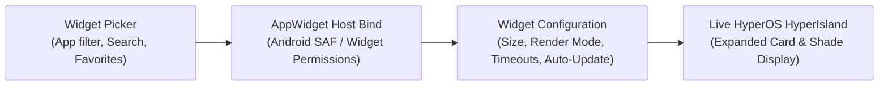

Hyper Bridge 0.6.0 features a native **Android AppWidget Host**, allowing you to place any standard Android home-screen widget (Spotify, Google Keep, Weather, Clock, Calendar, Smart Home toggles, etc.) directly into your Xiaomi HyperOS **HyperIsland**!

Instead of being confined to static notifications, widgets running inside HyperIsland can remain interactive, refresh automatically in the background, or appear when needed.



---

## 1. How to Add a Widget

You can add a widget in two different ways depending on your workflow:

### Method A: From the Design Hub
1. Navigate to the **Design** tab in Hyper Bridge.
2. Tap the **`+` (Add)** Floating Action Button and select **System Widget**, or tap the `+` action button inside the **Widgets** Bento card.
3. The **Widget Picker Screen** will open, listing all applications on your device that provide home-screen widgets.

### Method B: From App Settings
1. Go to **Active Apps** or **Library** and tap the app you want to configure (e.g., Spotify, Google Calendar).
2. Scroll to the **Island Widgets** section.
3. Tap **Add Widget**. The picker will automatically open pre-filtered to widgets provided exclusively by that application!

---

## 2. Browsing & Selecting Widgets (The Widget Picker)

Access the widget catalog by tapping **`+` (Add Widget)** from the **Saved Widgets** screen or the Design Hub Bento Grid:



Tapping the **`+`** button opens the **Widget Picker Screen**:



The picker provides:
- **Instant Search**: Type the name of any app or widget title in the top search bar.
- **Favorites & Recommendations**: Star widget providers to keep them at the top of your list.
- **Collapsible App Groups**: Tap any application card (e.g. YouTube Music, Spotify) to expand all available widget sizes and interactive previews:



> [!NOTE]
> **Android Widget Binding Permission:**  
> The first time you select a widget from an application, Android will prompt you with a system dialog: *"Allow Hyper Bridge to create widgets and access their data?"* Tap **Always allow** or **Create** to grant the AppWidget Host permission.

---

## 3. Configuring Your Widget (`WidgetConfigScreen`)

Once you pick a widget, you will enter the **Widget Configuration Screen**. Here you can preview how the widget renders in real time and customize its visual size and runtime behavior.

```text
┌──────────────────────────────────────────────────────────┐
│              Live HyperIsland Widget Preview            │
│  [ Spotify Player: Playing Song - Album Art - Controls ]  │
└──────────────────────────────────────────────────────────┘
 [ Appearance Tab ]                     [ Behavior Tab ]
 • Size (Small / Medium / Large / etc.) • Show in Notification Shade
 • Render Mode (Interactive / Bitmap)   • Auto-Hide Timeout (TTL)
                                        • Auto-Update Interval
```

The configuration screen is split into two primary tabs:

### Tab 1: Appearance



| Setting | Options | Description |
|---|---|---|
| **Render Mode** | `Interactive`, `Snapshot` | **Interactive**: Allows tapping widget buttons, play/pause controls, and action triggers directly on the island.<br>**Snapshot**: Captures a crisp image snapshot of the widget. Recommended for complex list views (like Calendar or Gmail) that may fail to bind interactive remote views in floating windows. |
| **Container Size** | `Small (100dp)`, `Medium (180dp)`, `Large`, `Original` | Controls the target container height on the island card. |



---

### Tab 2: Behavior

Switch to the **Behavior** tab to manage how and when the widget appears:



| Setting | Default | Description |
|---|---|---|
| **Show in Shade** | Enabled (`true`) | When enabled, keeps the widget accessible in the standard Android notification pull-down shade in addition to the floating HyperIsland. |
| **Auto Close** | Disabled / Enabled | When turned on, you can configure an idle slider (e.g., 5 to 60 seconds). The island card will automatically dismiss after the duration expires. |



---

## 4. Managing Your Saved Widgets (`SavedAppWidgetsScreen`)

After configuring your widget, tap **Save** (or the Play button) to store it in your widget library:



In the **Saved Widgets** list:
- **Live Preview Container**: Shows the live interactive widget rendering in its assigned size.
- **Show on Island**: Tap to immediately spawn the widget on your device's HyperIsland to test how it looks and behaves!
- **Delete (`Trash`)**: Remove the widget from the island host.

---

## 5. Live Island Experience on Home Screen

When triggered, the widget renders seamlessly at the top of your screen as a native Xiaomi HyperOS HyperIsland card:





## Tips & Best Practices

- **Interactive Media Widgets**: If your music player does not output standard Android media notifications, mounting its official 4x1 or 4x2 widget inside Hyper Bridge gives you 100% reliable island playback controls!
- **Battery & Performance**: For widgets that don't need real-time second counters, leave **Auto-Update** at 15–30 minutes or rely on the host application's native widget broadcast to maximize battery life.
- **Combined with Translators**: You can assign specific widgets to trigger alongside custom notification translators or view them on-demand.
