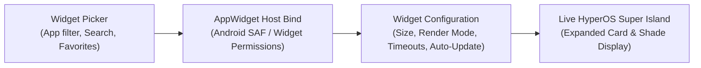

Hyper Bridge 0.6.0 features a native **Android AppWidget Host**, allowing you to place any standard Android home-screen widget (Spotify, Google Keep, Weather, Clock, Calendar, Smart Home toggles, etc.) directly into your Xiaomi HyperOS **Super Island**!

Instead of being confined to static notifications, widgets running inside Super Island can remain interactive, refresh automatically in the background, or appear when needed.



---

## 1. How to Add a Widget

You can add a widget in two different ways depending on your workflow:

### Method A: From the Design Hub
1. Navigate to the **Design** tab in Hyper Bridge.
2. Tap the **`+` (Add)** Floating Action Button and select **System Widget**, or tap the `+` action button inside the **Widgets** Bento card.
3. The **Widget Picker Screen** will open, listing all applications on your device that provide home-screen widgets.

### Method B: From App Settings
1. Go to **Active Apps** or **Library** and tap the app you want to configure (e.g., Spotify, Google Calendar).
2. Scroll to the **Island Widgets** section.
3. Tap **Add Widget**. The picker will automatically open pre-filtered to widgets provided exclusively by that application!

---

## 2. Browsing & Selecting Widgets (The Widget Picker)

The **Widget Picker Screen** organizes your device's available widgets:

- **Instant Search**: Type the name of any app or widget title in the top search bar.
- **Favorites Tab**: Star frequently used widget providers (like your preferred media player or task manager) to keep them at the top of the list.
- **Collapsible App Groups**: Each application card displays its app icon, name, and total available widget variations. Tap any card to expand its widget previews.
- **Preview Cards**: View the official widget provider preview, dimensions (cells or dp), and descriptive labels before binding.

> [!NOTE]
> **Android Widget Binding Permission:**  
> The first time you select a widget from an application, Android will prompt you with a system dialog: *"Allow Hyper Bridge to create widgets and access their data?"* Tap **Always allow** or **Create** to grant the AppWidget Host permission.

---

## 3. Configuring Your Widget (`WidgetConfigScreen`)

Once you pick a widget, you will enter the **Widget Configuration Screen**. Here you can preview how the widget renders in real time and customize its visual size and runtime behavior.

```text
┌──────────────────────────────────────────────────────────┐
│              Live Super Island Widget Preview            │
│  [ Spotify Player: Playing Song - Album Art - Controls ]  │
└──────────────────────────────────────────────────────────┘
 [ Appearance Tab ]                     [ Behavior Tab ]
 • Size (Small / Medium / Large / etc.) • Show in Notification Shade
 • Render Mode (Interactive / Bitmap)   • Auto-Hide Timeout (TTL)
                                        • Auto-Update Interval
```

The configuration screen is split into two primary tabs:

### Tab 1: Appearance

| Setting | Options | Description |
|---|---|---|
| **Widget Size** | `SMALL`, `MEDIUM`, `LARGE`, `XLARGE`, `ORIGINAL` | Controls the target container dimensions on the island card. `MEDIUM` is recommended for standard 4x1/4x2 widgets; `LARGE` is ideal for multi-line agendas and weather graphs. |
| **Render Mode** | `INTERACTIVE`, `STATIC_BITMAP` | **Interactive**: Allows tapping widget buttons, checkboxes, and playback controls directly on the island.<br>**Static Bitmap**: Captures a crisp image snapshot of the widget (best for lightweight static glanceables or battery preservation). |

### Tab 2: Behavior

| Setting | Default | Description |
|---|---|---|
| **Show in Shade** | Enabled (`true`) | When enabled, keeps the widget notification accessible in the standard Android notification pull-down shade in addition to the floating Super Island. |
| **Auto-Hide Timeout** | Disabled (`false`) | When turned on, you can configure an idle slider (e.g., 5 to 60 seconds). The island card will automatically dismiss after the duration expires. |
| **Auto-Update** | Disabled (`false`) | Enables background periodic re-fetching of the widget view (configurable from 15 seconds to 30 minutes), ensuring clocks, battery widgets, and weather trackers stay fresh. |

---

## 4. Managing Your Saved Widgets (`SavedAppWidgetsScreen`)

To view, re-configure, test, or remove widgets you have already mounted:
1. Tap the **Widgets** card in the Design Hub Bento Grid.
2. In the **Saved Widgets** list:
   - **Live Preview Container**: Shows the live interactive widget rendering in its assigned size.
   - **Edit Settings**: Tap the edit button to adjust size, timeouts, or render mode at any time.
   - **Quick Test (Play Button)**: Tap the play icon to immediately spawn the widget on your device's Super Island to test how it looks and behaves!
   - **Delete**: Remove the widget from the island host.

---

## Tips & Best Practices

- **Interactive Media Widgets**: If your music player does not output standard Android media notifications, mounting its official 4x1 or 4x2 widget inside Hyper Bridge gives you 100% reliable island playback controls!
- **Battery & Performance**: For widgets that don't need real-time second counters, leave **Auto-Update** at 15–30 minutes or rely on the host application's native widget broadcast to maximize battery life.
- **Combined with Translators**: You can assign specific widgets to trigger alongside custom notification translators or view them on-demand.
