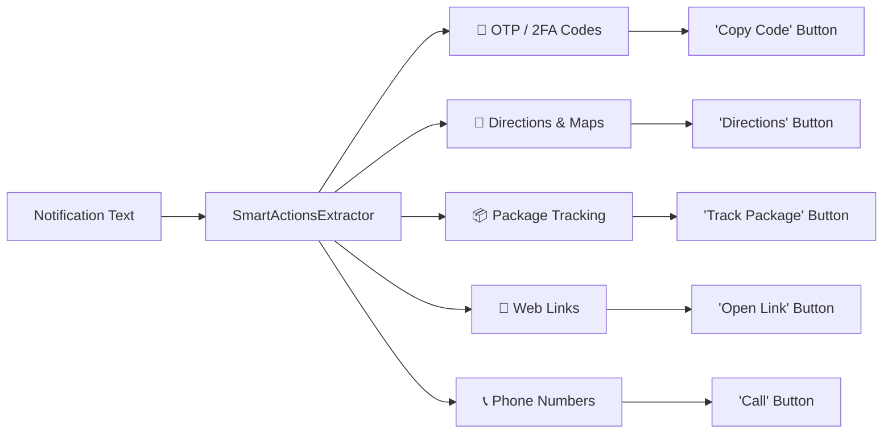

**Smart Actions** supercharge your notifications by automatically detecting actionable entities—such as 2FA verification codes, street addresses, map links, phone numbers, and package tracking numbers—and injecting contextual 1-tap action buttons directly onto the **HyperIsland** (Super Island) and notification shade.

Instead of switching apps or memorizing codes, you can copy an OTP, jump into your preferred navigation app, or call a driver with a single tap.

---

## Supported Smart Action Types

Hyper Bridge features an intelligent, multi-language entity extractor supporting five distinct action categories:



### 1. One-Time Passwords (OTP / 2FA)
- **What it does:** Detects authentication codes and security tokens (4 to 8 digits) in SMS and chat notifications.
- **Action:** Injects a **"Copy Code"** button that copies the code directly to your system clipboard and shows a quick confirmation toast.
- **Privacy Mode:** Enable **"Hide OTP Code"** in settings so the code itself is never displayed in plaintext on the island or status bar—only the "Copy Code" button appears.

### 2. Navigation & Directions
- **Shared Map Links:** Automatically detects location links from Google Maps (including `maps.app.goo.gl` and `goo.gl/maps` short links), Apple Maps, Waze, OpenStreetMap, HERE WeGo, Bing Maps, Mapy.cz, Yandex, Baidu, and raw `geo:` URIs.
- **Street Addresses:** Intelligent multilingual address parser detecting street names and numbers across:
  - **English & International:** `"221B Baker Street"`, `"10 Downing St"`.
  - **Spanish, Galician, Catalan:** `"Calle Mayor 12"`, `"Rúa do Vilar 5"`, `"Av. Diagonal nº 640"`.
  - **French:** `"12 rue de la Paix"`, `"Avenue des Champs-Élysées 45"`.
  - **Italian:** `"Via Roma 3"`, `"Corso Italia 18"`.
  - **German & Dutch:** `"Hauptstraße 5"`, `"Kalverstraat 92"` (with context or postal code validation).
- **Action:** Injects a **"Directions"** button that opens a `geo:0,0?q=` search or direct map URI, letting Android present your installed navigation apps (Google Maps, Waze, OsmAnd).

### 3. Package Tracking
- **What it does:** Scans delivery notifications for carrier tracking identifiers (e.g. DHL, FedEx, UPS, USPS, Correos, Amazon, and regional couriers).
- **Action:** Injects a **"Track Package"** button labeled with the detected carrier name, opening the carrier's live tracking portal with your tracking number pre-filled.

### 4. Web Links (URLs)
- **What it does:** Identifies URLs shared in chat messages or alerts (excluding map links, which are intelligently routed to the Navigation action).
- **Action:** Injects an **"Open Link"** button to view the page in your default browser.

### 5. Phone Numbers
- **What it does:** Detects international and local phone numbers formatted in national and E.164 styles (e.g., `+34 612 345 678` or `(555) 234-5678`).
- **Action:** Injects a **"Call"** button that launches your phone dialer with the number pre-loaded.

---

## Precedence & Action Limits

To keep the HyperIsland clean, ergonomic, and readable, Smart Actions follow strict priority rules:

1. **Extraction Precedence:** When multiple entities appear in a single message (e.g. an address and a website URL), entities are ranked in priority order:
   $$\text{OTP} \succ \text{Package Tracking} \succ \text{Navigation} \succ \text{Web Links} \succ \text{Phone Numbers}$$
2. **Navigation over Generic URLs:** If a notification contains a Google Maps or Waze link, the Navigation extractor claims it first. You receive a dedicated **"Directions"** button rather than a redundant "Open Link" button.
3. **Action Button Cap:** Smart Actions are capped at **2 buttons per notification** to avoid crowding original app actions.

---

## Privacy & Security Guarantees

Smart Actions are built with strict local-first privacy principles:

- **100% On-Device Processing:** The entity extraction engine is written in pure Kotlin and executes entirely on your device. Notification text is **never** sent to cloud servers, remote APIs, or third-party NLP models.
- **Zero Overhead When Disabled:** Smart Actions is **disabled by default**. When turned off, the engine never scans or evaluates incoming notification text, incurring 0% CPU overhead.
- **No Internet Permission:** Hyper Bridge does not request or possess the `android.permission.INTERNET` permission, making data transmission technically impossible.
- **Granular Per-App Privacy Overrides:** You can disable Smart Actions globally, exclude specific apps entirely (e.g. sensitive banking or enterprise apps), or turn off specific types (like OTP) for particular apps while keeping them active elsewhere.

---

## Configuring Smart Actions

### Global Settings
In the Hyper Bridge app, navigate to **Settings** &rarr; **Smart Actions**:
- **Master Toggle:** Enable or disable Smart Actions globally.
- **Category Toggles:** Selectively enable or disable `OTP`, `Directions`, `Package Tracking`, `Web Links`, or `Phone Numbers`.
- **Hide OTP Code:** Prevent verification codes from displaying on the lock-safe status bar or expanded island.

### Per-App Privacy Overrides
You can customize Smart Actions behavior for any specific application:
1. Go to **Library** and select an app (e.g., your banking or password manager app).
2. Scroll to the **Smart Actions** section.
3. Choose to **Exclude App** completely or override individual features (e.g., turn off OTP scanning for Bank App while retaining it for SMS).

---

## Integration with Custom Translators

If you are using the [Custom Translators Framework](), you can explicitly bind any action button slot to Smart Actions:

```json
{
  "slot_position": 0,
  "is_visible": true,
  "source": "SMART_ACTION",
  "smart_action_type": "OTP_COPY",
  "display_mode": "ICON_AND_TEXT",
  "custom_label": "Copy Code"
}
```

Available `smart_action_type` targets in Custom Translators:
- `OTP_COPY`: Injects 1-tap clipboard code copying.
- `OPEN_URL`: Opens extracted web links.
- `DIAL_NUMBER`: Launches dialer for extracted contact numbers.
- `TRACK_PACKAGE`: Opens the carrier tracking page.

For detailed schema specifications, see the [Translators Technical Specification]().
