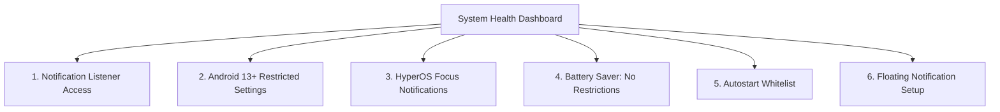
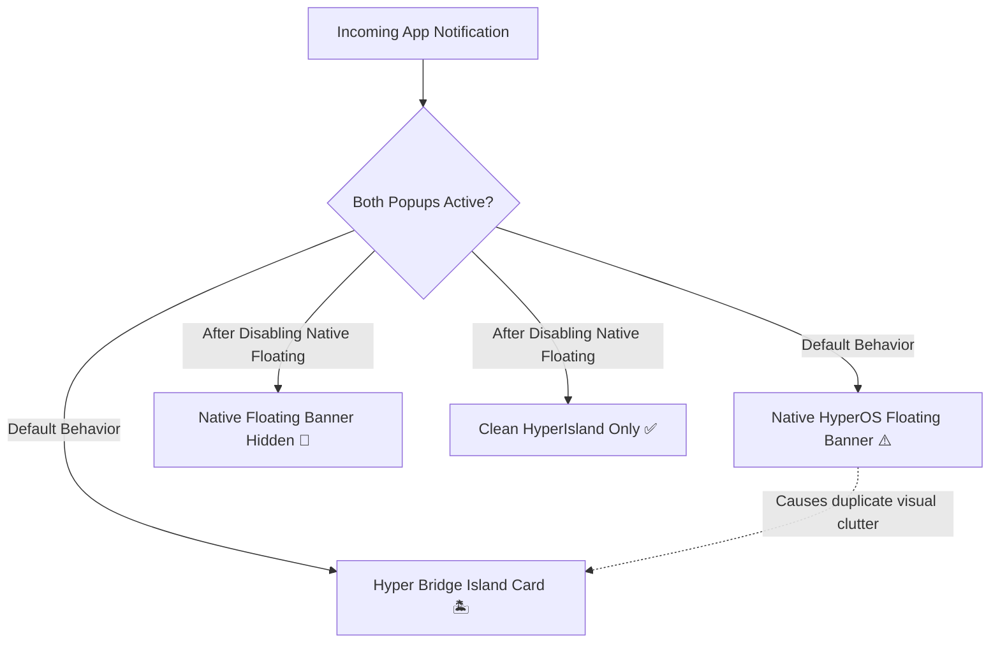

Xiaomi HyperOS is known for its strict background memory management and multi-tiered permission system. To ensure that Hyper Bridge can reliably intercept incoming notifications, render islands seamlessly, and stay alive in the background, the app includes a central **System Health Dashboard** (`SetupHealthScreen`) and a dedicated **Floating Notification Setup** manager.

This guide walks you through every step required to achieve a **100% Healthy** setup.

---

## 1. The System Health Dashboard

In Hyper Bridge, open **Settings** &rarr; **System Health** (or tap the Health card in [Diagnostics]()):

At the top of the screen, an expressive **Hero Banner** tracks your setup progress:
- **Green ("System Health: Good"):** All essential permissions are granted and the listener watchdog is active.
- **Amber / Orange ("Needs Attention"):** One or more required permissions are missing or restricted, preventing islands from displaying properly.



---

## 2. Essential Permissions Checklist

Each card on the System Health screen provides a 1-tap shortcut directly to the corresponding Xiaomi system settings page:



### Step 1: Notification Listener Access
- **Why it is required:** Android prohibits regular apps from reading alerts from other apps. Notification Listener access allows Hyper Bridge to observe incoming notifications and forward them to the island engine.
- **How to grant:** Tap **Grant Permission** &rarr; Locate **Hyper Bridge** in the device list &rarr; Toggle the switch ON &rarr; Accept Xiaomi's standard 10-second security confirmation.
- *Detailed guide:* [Notification Listener Access Guide]().

---

### Step 2: Android 13+ Restricted Settings
- **The Issue:** On Android 13, 14, and 15, Google introduced a security measure that automatically greys out Notification Listener and Accessibility permissions for apps installed from outside the Google Play Store (e.g., APK downloads from GitHub).
- **How to resolve:**
  1. Open your phone's **Settings** &rarr; **Apps** &rarr; **Manage apps**.
  2. Search for and select **Hyper Bridge**.
  3. Tap the **three dots (⋮)** in the top-right corner of the App Info screen.
  4. Tap **Allow restricted settings**.
  5. Verify your device PIN or fingerprint when prompted.
  6. Return to Hyper Bridge; the Notification Listener toggle will now be interactive.

---

### Step 3: HyperOS Focus Notifications
- **Why it is required:** Xiaomi HyperOS manages dynamic island elements through the native **Focus Notifications** channel. Without this permission, Hyper Bridge cannot render floating cards over other applications.
- **How to grant:** Tap **Configure Focus Notifications** on the health card &rarr; Ensure that **Allow floating notifications** and **Focus notifications** are enabled for Hyper Bridge.
- *Detailed guide:* [HyperOS Focus Notifications Guide]().

---

### Step 4: Battery Saver: "No Restrictions"
- **The Issue:** Xiaomi's MIUI/HyperOS power manager automatically kills background services after 10–15 minutes of screen-off time if left on the default "Smart" battery profile.
- **How to configure:**
  1. Tap **Configure Battery Saver** on the health card.
  2. Select **No restrictions**.
  3. Hyper Bridge can now maintain its event-driven listener indefinitely without being terminated.
- *Detailed guide:* [Battery Saver & Autostart Guide]().

---

### Step 5: Autostart Whitelist
- **Why it is required:** Allows the Hyper Bridge background service to automatically initialize whenever you reboot your phone.
- **How to grant:** Tap **Enable Autostart** &rarr; Toggle the switch next to **Hyper Bridge** to ON.

---

## 3. Floating Notification Setup (Optional: Avoid Duplicate Popups)


**This step is completely optional:** It does not affect Hyper Bridge's ability to bridge notifications. Its sole purpose is to help you hide duplicate native pop-up animations if you prefer seeing only the HyperIsland.


### Why Does This Exist?
When an app (such as WhatsApp, Telegram, or Spotify) posts a notification while your screen is on, Android / HyperOS normally drops down a native system **floating pop-up banner** at the top of your screen.

At the exact same time, Hyper Bridge renders the **HyperIsland** card. This can result in **two overlapping popups** appearing simultaneously:
1. The native Xiaomi floating notification banner.
2. The custom Hyper Bridge Super Island card.

---

### How to Prevent Duplicate Popups
You have two easy choices:

#### Choice A: Keep Only the Island (Recommended)
1. Navigate to **Settings** &rarr; **Floating Notification Setup** in Hyper Bridge.
2. Tap any app card to jump directly to that app's system notification settings.
3. Turn **OFF** the system switch for **"Floating notifications"** (keep standard notifications and badges enabled).
4. Return to Hyper Bridge and tap the checkmark to mark it as confirmed.
5. Incoming messages will now display **only on the HyperIsland**, without the intrusive native system banner.

#### Choice B: Prefer Native Floating Banners
If you prefer Xiaomi's native floating heads-up popups over the island's floating banner:
- Leave native floating notifications enabled on your apps.
- Go to Hyper Bridge **Settings** &rarr; **Global Configuration** and turn off **Heads-up Popup (Notificación Emergente)**.
- Hyper Bridge will still bridge your notifications into the compact status bar pill and notification shade without drawing a floating island card.

---

### Using the Floating Setup Screen
Navigate to **Settings** &rarr; **Floating Notification Setup** (or tap the checklist card in System Health):



1. **Status Filter Chips:**
   - **All:** Displays all applications enabled in your Hyper Bridge library.
   - **Needs Review:** Highlights apps where native floating banners have not yet been reviewed.
   - **Confirmed:** Shows apps you have already reviewed and confirmed.
2. **Instant Search:** Quickly search for any app by name or package identifier.
3. **1-Tap App Settings Shortcut:** Tap any app in the list to open its native Xiaomi notification channel page.
4. **Batch "Mark All as Confirmed":** If you are satisfied with your current notifications or prefer not to customize apps individually, toggle **Mark all as confirmed** in the top bar to dismiss all review badges at once.

---

## Next Steps

- Want to verify your service connection in real time? Open the [Diagnostics & System Health Monitor]().
- Running into persistent background drops? Read [Known Issues & HyperOS Quirks]().
- Explore advanced capabilities like Shizuku automation in the [Shizuku Setup Guide]().
