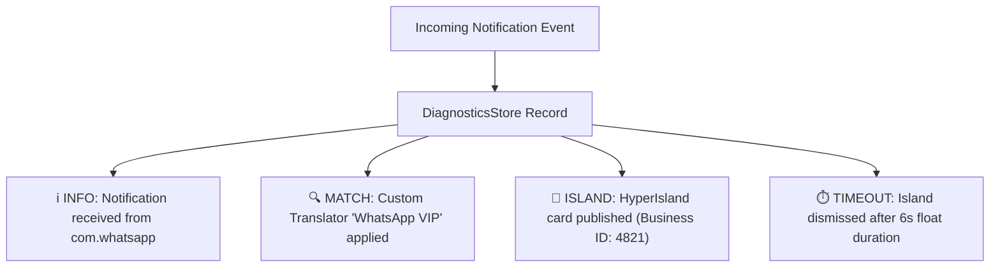

The **Diagnostics Screen** in Hyper Bridge provides real-time visibility into the internal operating state of the bridge engine. It gives you instant insight into listener service connectivity, permission health, recent notification event streams, and translation statistics.

If notifications are failing to bridge, or if an island dismisses unexpectedly, the Diagnostics Screen is your primary tool for diagnosing what is happening under the hood.

---

## Accessing Diagnostics

In the Hyper Bridge application, navigate to:
**Settings** &rarr; **Diagnostics** (under the Support & Troubleshooting section).

---

## 1. System Health Status Card

At the top of the Diagnostics screen, an aggregated **Health Status Card** summarizes your core system permissions:
- **Notification Access:** Whether Hyper Bridge is actively granted Android Notification Listener privileges.
- **Post Notifications:** Permission to create status bar notifications.
- **Restricted Settings:** Whether Android 13+ restricted settings have been authorized for sideloaded APKs.
- **HyperOS Focus Notifications:** Whether Xiaomi's native focus/island notification channel permission is active.




Tapping the health card immediately navigates to the interactive [System Health & Setup Guide](), where you can resolve any missing permissions in one tap.


---

## 2. Live Service Metrics

Below the health card, a responsive grid displays real-time telemetry from the running notification engine:

| Metric | Description | Expected State |
|---|---|---|
| **Service Status** | Live connection state of `NotificationReaderService`. | `Connected` (Green). If disconnected, tap **Reconnect** to re-bind immediately. |
| **Selected Apps** | Number of applications enabled in your Hyper Bridge Library. | Matches your enabled apps count. |
| **Floating Review** | Number of enabled apps pending review to optionally hide duplicate native pop-up banners. | `0` (or tap to review in [Floating Setup]()). |
| **Active Islands** | Number of notification islands currently active on the device screen. | `0` when idle; increments dynamically when notifications arrive. |
| **Last Classification** | Domain category assigned to the most recent notification (`MESSAGING`, `MEDIA`, `CALL`, `PROGRESS`, or `STANDARD`). | Reflects the category of your latest received alert. |
| **Last Call State** | State machine status of active phone or VoIP calls (`INCOMING_RINGING`, `ONGOING`, `MISSED`). | Visible during active phone calls. |
| **Last Translator** | Displays the name of the Custom Translator rule matched against the latest notification. | Shows custom rule name if matched; otherwise `Default`. |

---

## 3. The Watchdog & Service Reconnect

Xiaomi's aggressive MIUI/HyperOS background process killer can occasionally terminate long-running notification listener services. 

Hyper Bridge incorporates an internal **Listener Watchdog**:
- **Automatic Reconnection:** Whenever you unlock your phone or launch Hyper Bridge, the watchdog verifies the listener connection and re-binds `NotificationReaderService` if it was dropped by the OS.
- **Manual "Reconnect Now" Button:** If the Diagnostics screen reports `Disconnected`, tap the **Reconnect** icon button in the top bar. This forcibly cycles the Android notification listener component and re-establishes the connection without requiring a device reboot.

---

## 4. Live Diagnostic Events Stream

The bottom section of the screen presents an append-only timeline of recent internal events captured by `DiagnosticsStore`:

### Event Levels Explained
- **`INFO` (Blue):** Normal operational events, such as notification receipt, media metadata updates, playback state changes, or island creation.
- **`WARN` (Yellow):** Non-fatal occurrences, such as an app being skipped due to missing floating notification confirmation, or an action slot index not found in the original notification.
- **`ERROR` (Red):** Failures that prevented an island from rendering, such as an invalid custom translator regex pattern, memory allocation limits, or an OS security rejection.

---

## 5. Exporting Diagnostics for Support

When requesting technical support in the community or filing a bug report:
1. Tap the **Copy Diagnostics** button in the Diagnostics screen header.
2. Hyper Bridge exports an anonymized log including:
   - Device model, Android OS version, and HyperOS build.
   - Core permission flags.
   - Active island telemetry.
   - Chronological event timeline (timestamps, source packages, and status codes).
3. Paste the diagnostic report into your GitHub issue or message.


**Privacy Guarantee:** Diagnostic event logs only record package names, system state codes, and operational flags. The actual text bodies and sensitive content of your notifications are **never** logged or exported.


---

## Next Steps

- Having trouble with permissions? Follow the [System Setup & Health Guide]().
- Need to report a persistent bug? Read the [Bug Reporting Guide]().
